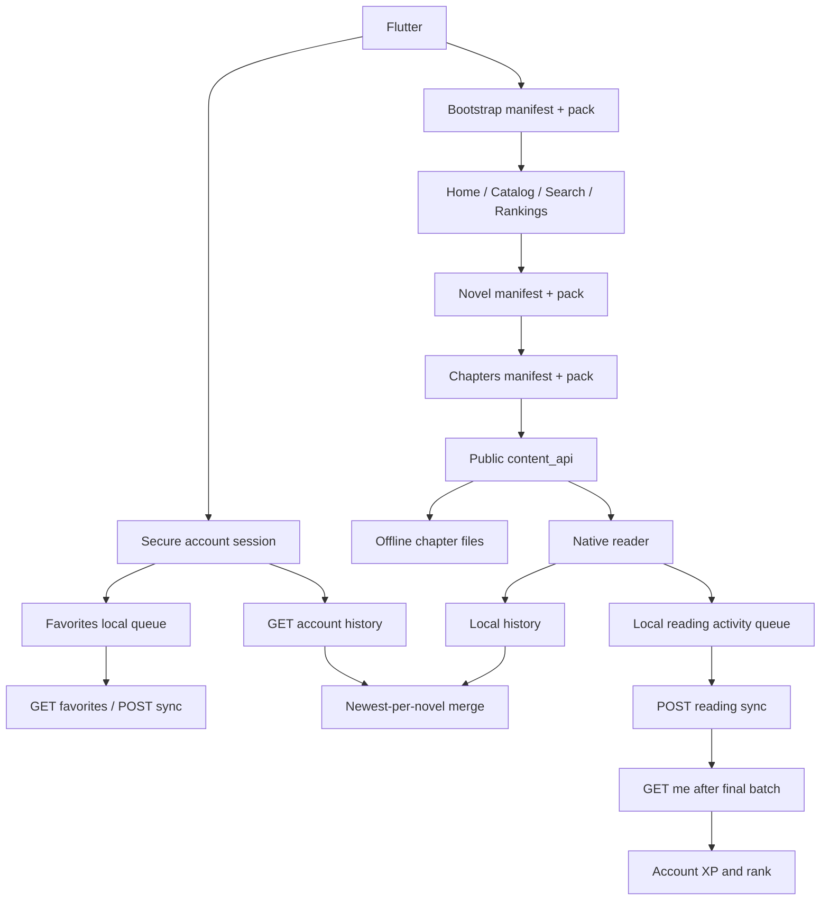

# تدقيق حالة التطبيق والـ API

تاريخ آخر تحديث: 24 يونيو 2026

## الهدف

هذا الملف يطابق بين:

- تطبيق Flutter الحالي.
- وثيقة `GALAXY_NOVELS_APP_API.md`.
- قالب Wor Reader v2471.
- الاستجابات الحية من `https://galaxynovels.com`.

الهدف هو معرفة ما نُفذ فعلا، وما هو موجود كواجهة فقط، وما يزال يحتاج دعما في التطبيق أو القالب.

## ترتيب مصادر الحقيقة

عند التعارض نعتمد الترتيب التالي:

1. استجابة الموقع الحية.
2. كود قالب v2471، خصوصا `inc/app-api.php` و`inc/app-cache.php`.
3. وثائق v2471.
4. وثيقة التطبيق الرئيسية والخطط القديمة.

وثيقة `docs/current_api_workflow.md` قديمة في جزء القارئ؛ تصف WebView، بينما v2471 والموقع الحي يقدمان `content_api` عامًا ومكاشى، والتطبيق يستخدمه في قارئ Native.

## الوضع الحي المؤكد

تم التحقق باستخدام User-Agent الرسمي `WorReaderApp/1.0 Android`:

- Bootstrap الثابت يعمل ويعلن `native_chapter_content_api: true`.
- `/wp-json/wor-reader-app/v1/bootstrap` عام ومكاشى عبر Cloudflare.
- `/wp-json/wor-reader-app/v1/chapters/{id}` يعيد JSON عامًا ومكاشى لمدة أسبوع على الـ edge.
- `/session` يعمل دون تسجيل دخول ويعيد `logged_in: false`.
- `/me` محمي ويعيد `401` دون جلسة.
- قراءة التعليقات العامة تعمل دون تسجيل دخول.
- التقييم الشخصي محمي ويحتاج جلسة.
- Store العام مفعّل ويحتوي خطة واحدة وقت التدقيق.

## التدفق المنفذ حاليا

## مصفوفة التنفيذ العام

| المجال | الحالة | الملاحظات |
|---|---|---|
| Bootstrap وبيانات الموقع | منفذ | يقرأ site وapi وروابط manifests وfeature flags الأساسية. |
| الرئيسية | منفذ | الرفوف تعمل، وأكمل القراءة يعتمد أحدث سجل محلي، وآخر التحديثات تفتح أحدث فصل في القارئ Native. |
| المكتبة | منفذ | تحميل تدريجي، بحث محلي/عام، فلاتر وترتيب وفتح التفاصيل. |
| البحث العام | منفذ | يعتمد search manifest/index ولا يرسل REST أثناء الكتابة. |
| الترتيب | منفذ | يعرض ترتيب الشهر ويفتح تفاصيل الرواية. |
| تفاصيل الرواية | منفذ جزئيا | البيانات والقراءة والتنزيل والمفضلة والتقييم الشخصي وقائمة الفصول الكسولة والبحث المحلي وتبويب التعليقات العامة تعمل؛ كتابة التعليقات وVIP غير موصولين. |
| فهرس الفصول | منفذ | يستخدم chapters manifest/pack و`content_api`. |
| القارئ Native | منفذ | يعرض HTML القادم داخل JSON كعناصر Flutter، بدون WebView. |
| الكاش العام | منفذ | ملفات عامة محليا مع fallback عند فشل الشبكة. |
| التنزيلات | منفذ | التخزين والدفعات والقراءة المحلية وفتح الفصول والحذف وعرض المساحة تعمل. الاستكمال بعد قتل عملية التطبيق غير منفذ. |
| سجل القراءة | منفذ | يسجل آخر فصل محليا، ويدمج الأحدث لكل رواية مع `GET /me/history`، ويحفظ نشاط الحساب في queue دائمة ثم يرسله إلى `/reading/sync`. تفاصيل سجل رواية واحدة ما زالت غير موصولة لأنها ليست مطلوبة لصفحة المتابعة الحالية. |
| إعدادات القارئ | منفذ | حجم الخط وتباعد الأسطر ووضع القراءة محفوظة محليا، وتعمل من القارئ ومن وجهة الإعدادات في القائمة الجانبية. |
| المفضلة | منفذ | شاشة حسابية في القائمة الجانبية وزر حقيقي في التفاصيل، مع cache محلي معزول لكل مستخدم ومزامنة مؤجلة عند انقطاع الاتصال. |
| VIP schedule العام | غير منفذ | الرابط موجود في بيانات الرواية والقالب، لكن لا يوجد repository أو UI. |
| Store config العام | غير منفذ | الرابط مقروء من bootstrap فقط. |
| التعليقات العامة | منفذ | تعليقات الرواية والفصل تعمل عبر repository وcontroller موحدين، مع pagination صريح، أربعة ترتيبات، ردود، حرق، حالات فراغ وفشل غير حاجب. لا يبدأ الطلب قبل فتح التبويب أو لوحة القارئ. |

## مصفوفة REST الخاص

| المجال | Endpoints | حالة التطبيق |
|---|---|---|
| الجلسة | `POST /auth/login`, `POST /auth/logout`, `GET /session`, `GET /me` | منفذ. يعمل الدخول والخروج واستعادة `/session` وتحديث الملف من `/me`. يحفظ خيار "تذكرني" الكوكيز والnonce فقط داخل `flutter_secure_storage`. يجدد nonce مرة واحدة عند انتهائه، ويحمي التحديث من تبديل الجلسة، ويدمج طلبات الملف المتزامنة مع cooldown مدته 60 ثانية. |
| حالة الرواية للمستخدم | `GET /me/novels/{novel_id}` | منفذ. تحمل شاشة التفاصيل الحالة للمستخدم المسجل فقط، وتحمي النتيجة من تبديل الحساب، وتعرض التقييم الشخصي وVIP الفعال. إذا طابق `last_read.chapter_id` فصلا عاما متاحا يتحول زر القراءة إلى متابعة ذلك الفصل داخل القارئ الأصلي. تبقى المفضلة المحلية ذات pending sync هي المصدر النهائي لزر المفضلة. |
| المفضلة | `GET /me/favorites`, `POST /me/favorites/sync` | منفذ. يجلب قائمة الحساب، يطبق الإضافة والحذف تفاؤليا، يضغط آخر تغيير لكل رواية، ويرسل الدفعات بحد أقصى 50 تغييرا ثم يصالح الحالة مع السيرفر. التغييرات غير المرسلة محفوظة محليا لكل user ID، وحد القائمة مطابق للقالب: 300 رواية. |
| السجل البعيد | `GET /me/history`, `GET /me/history/novel/{id}` | منفذ جزئيا. قائمة `/me/history` مدمجة مع السجل المحلي ومعزولة حسب الحساب؛ تفاصيل رواية واحدة غير موصولة بعد. بيانات السيرفر لا تعطي إجمالي فصول الرواية، لذلك لا يحسب التطبيق منها نسبة إنجاز زائفة. |
| نشاط القراءة وXP | `POST /reading/sync` | منفذ. القارئ يقيس foreground open time والنشاط لمدة 60 ثانية بعد التفاعل، ويحفظ أحداثا ثابتة معزولة لكل user ID، ويرسل حتى 50 حدثا في الدفعة مع منع التكرار وoffline retry. بعد قبول آخر دفعة وتفريغ queue محليا، يحدث التطبيق `/me` ويعرض XP الإجمالي وXP اليوم والرتبة والفصول المقروءة من السيرفر دون حساب محلي. |
| التقييمات | `GET/POST /ratings/novel/{id}` | منفذ عمليا دون طلب مكرر. يقرأ التطبيق `my_rating` من `GET /me/novels/{id}` عند فتح التفاصيل، لذلك لا يرسل `GET /ratings` إضافيا. يرسل التقييم من نجمة إلى خمس عبر `POST /ratings/novel/{id}`، ويطبق فقط القيمة التي يعيدها السيرفر، مع معالجة انتهاء الجلسة و`429`. |
| التعليقات | `GET/POST /comments/{type}/{id}` | منفذ جزئيا. `GET` العام منفذ للرواية والفصل. `POST` وإنشاء الردود غير منفذين ويحتاجان جلسة. |
| التصويت والتفاعل | vote وreaction | غير منفذ. |
| VIP الخاص | chapters وcontinuous-next وlibrary-counts | غير منفذ. |
| الدفع والاشتراك | مسارات store الخاصة | غير منفذ ومؤجل. |
| جوائز المترجمين | `POST /translator-awards/vote` | غير منفذ ومؤجل. |

## فجوات داخل التطبيق لا تحتاج API جديدا

1. مدير التنزيل يستمر عند التنقل داخل التطبيق، لكنه لا يستعيد مهمة شبكة جارية بعد قتل عملية التطبيق أو إعادة تشغيل الهاتف.
2. اختيار ثيم التطبيق مجهز بالتوكنز فقط، ولا توجد شاشة أو persistence بعد.

## فجوات تحتاج قرارا أو دعما إضافيا

- لا توجد endpoints في namespace الحالي لإنشاء حساب أو استعادة كلمة المرور. يلزم إما صفحات الويب الرسمية أو إضافة endpoints مخصصة.
- تعديل الاسم والصورة موجود في namespace قديم `wor-reader/v1/account/*` وليس ضمن app API الموحد.
- نظام نقاط التنزيل والإعلانات المقترح ليس جزءا من API الحالي، وسيبقى مؤجلا حتى تصميم قواعده ومنع التحايل.
- الإشعارات الفورية غير موجودة في الـAPI الحالي وتحتاج FCM/APNs وبنية تسجيل device tokens.
- VIP content لا يجوز حفظه مثل الفصول العامة دون سياسة انتهاء وحذف مرتبطة بالاشتراك.

## ترتيب التنفيذ المعتمد

### المرحلة 1: إكمال دورة القراءة المحلية

1. إكمال شاشة التنزيلات وعمليات الفتح والحذف. (مكتمل)
2. حفظ إعدادات القارئ وربط شاشة الإعدادات. (مكتمل)
3. ربط أكمل القراءة وآخر التحديثات بالتنقل الحقيقي. (مكتمل)
4. تحسين أداء قائمة الفصول الطويلة والبحث داخلها. (مكتمل)

هذه المرحلة لا تحتاج تسجيل دخول، وتغلق وظائف ظاهرة للمستخدم لكنها ناقصة حاليا.

### المرحلة 2: أساس الجلسة والحساب

1. `PrivateApiClient` موحد للكوكيز وnonce و`no-store`، ويأخذ User-Agent من `AppConfig`. (مكتمل)
2. `AuthRepository` مع restore session وتسجيل الدخول والخروج. (مكتمل)
3. تخزين آمن اختياري للجلسة، ومعالجة انتهاء nonce و401 ضمن دورة الحساب. (مكتمل)
4. شاشة حساب فعلية وحالات ضيف/تحميل/خطأ/مسجل. (مكتمل)

### المرحلة 3: بيانات المستخدم والمزامنة

1. المفضلة مع queue محلية ومزامنة مجمعة. (مكتمل)
2. دمج السجل المحلي والبعيد بدون فقدان الأحدث. (مكتمل لقائمة `GET /me/history`)
3. queue لأحداث القراءة وإرسال `/reading/sync` على دفعات. (مكتمل)
4. إظهار XP القادم من السيرفر دون حسابه محليا. (مكتمل)

### المرحلة 4: التفاعل العام

1. عرض التعليقات العامة للرواية والفصل. (مكتمل)
2. إنشاء التعليقات والردود بعد تسجيل الدخول.
3. التقييم الشخصي. (مكتمل)
4. التصويت والتفاعلات.
5. عرض VIP schedule العام.

### المرحلة 5: VIP والمتجر

تأتي بعد استقرار الجلسة والمزامنة. تشمل فصول VIP، سياسة الكاش القصير، الاشتراك والدفع. نظام النقاط والإعلانات ليس جزءا من هذه المرحلة تلقائيا.

## الخطوة التالية مباشرة

نبدأ بإنشاء التعليقات والردود للمستخدم المسجل عبر `POST /comments/{type}/{id}` فوق بنية القراءة الحالية، مع تجديد الجلسة ومعالجة القيود من السيرفر. التصويت والتفاعلات يبقيان مرحلة منفصلة بعد استقرار الكتابة. يبقى `GET /me/history/novel/{id}` اختياريا عند الحاجة إلى شاشة تفاصيل سجل الرواية، وليس مطلوبا لصفحة المتابعة الحالية.
