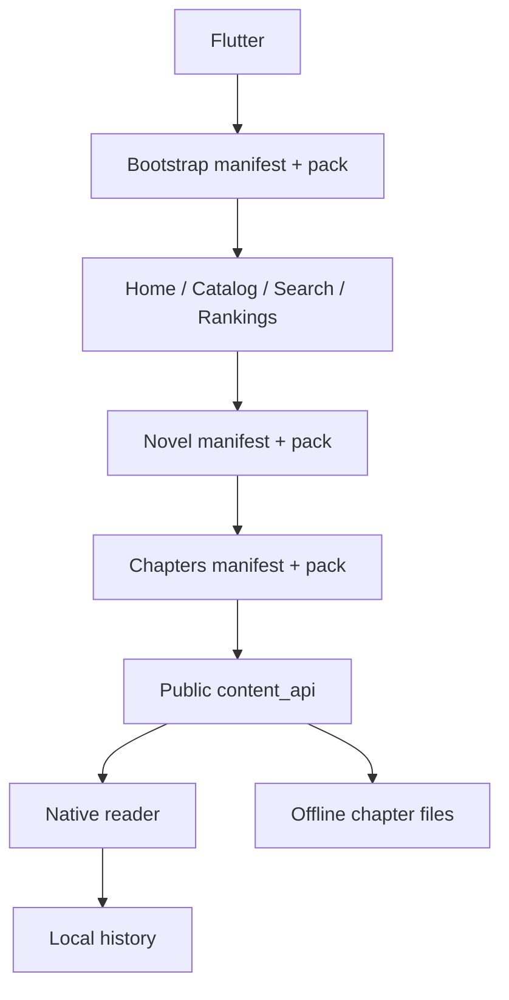

# تدقيق حالة التطبيق والـ API

تاريخ التدقيق: 21 يونيو 2026

## الهدف

هذا الملف يطابق بين:

- تطبيق Flutter الحالي.
- وثيقة `GALAXY_NOVELS_APP_API.md`.
- قالب Wor Reader v2471.
- الاستجابات الحية من `https://galaxynovels.com`.

الهدف هو معرفة ما نُفذ فعلا، وما هو موجود كواجهة فقط، وما يزال يحتاج دعما في التطبيق أو القالب.

## ترتيب مصادر الحقيقة

عند التعارض نعتمد الترتيب التالي:

1. استجابة الموقع الحية.
2. كود قالب v2471، خصوصا `inc/app-api.php` و`inc/app-cache.php`.
3. وثائق v2471.
4. وثيقة التطبيق الرئيسية والخطط القديمة.

وثيقة `docs/current_api_workflow.md` قديمة في جزء القارئ؛ تصف WebView، بينما v2471 والموقع الحي يقدمان `content_api` عامًا ومكاشى، والتطبيق يستخدمه في قارئ Native.

## الوضع الحي المؤكد

تم التحقق باستخدام User-Agent الرسمي `WorReaderApp/1.0 Android`:

- Bootstrap الثابت يعمل ويعلن `native_chapter_content_api: true`.
- `/wp-json/wor-reader-app/v1/bootstrap` عام ومكاشى عبر Cloudflare.
- `/wp-json/wor-reader-app/v1/chapters/{id}` يعيد JSON عامًا ومكاشى لمدة أسبوع على الـ edge.
- `/session` يعمل دون تسجيل دخول ويعيد `logged_in: false`.
- `/me` محمي ويعيد `401` دون جلسة.
- قراءة التعليقات العامة تعمل دون تسجيل دخول.
- التقييم الشخصي محمي ويحتاج جلسة.
- Store العام مفعّل ويحتوي خطة واحدة وقت التدقيق.

## التدفق المنفذ حاليا

## مصفوفة التنفيذ العام

| المجال | الحالة | الملاحظات |
|---|---|---|
| Bootstrap وبيانات الموقع | منفذ | يقرأ site وapi وروابط manifests وfeature flags الأساسية. |
| الرئيسية | منفذ | الرفوف تعمل، وأكمل القراءة يعتمد أحدث سجل محلي، وآخر التحديثات تفتح أحدث فصل في القارئ Native. |
| المكتبة | منفذ | تحميل تدريجي، بحث محلي/عام، فلاتر وترتيب وفتح التفاصيل. |
| البحث العام | منفذ | يعتمد search manifest/index ولا يرسل REST أثناء الكتابة. |
| الترتيب | منفذ | يعرض ترتيب الشهر ويفتح تفاصيل الرواية. |
| تفاصيل الرواية | منفذ جزئيا | البيانات والقراءة والتنزيل وقائمة الفصول الكسولة والبحث المحلي تعمل؛ المفضلة والتقييمات والتعليقات وVIP غير موصولة. |
| فهرس الفصول | منفذ | يستخدم chapters manifest/pack و`content_api`. |
| القارئ Native | منفذ | يعرض HTML القادم داخل JSON كعناصر Flutter، بدون WebView. |
| الكاش العام | منفذ | ملفات عامة محليا مع fallback عند فشل الشبكة. |
| التنزيلات | منفذ | التخزين والدفعات والقراءة المحلية وفتح الفصول والحذف وعرض المساحة تعمل. الاستكمال بعد قتل عملية التطبيق غير منفذ. |
| سجل القراءة | محلي فقط | يسجل آخر فصل، ولا يتزامن مع الحساب أو `/reading/sync`. |
| إعدادات القارئ | منفذ | حجم الخط وتباعد الأسطر ووضع القراءة محفوظة محليا، وتعمل من القارئ ومن وجهة الإعدادات في القائمة الجانبية. |
| VIP schedule العام | غير منفذ | الرابط موجود في بيانات الرواية والقالب، لكن لا يوجد repository أو UI. |
| Store config العام | غير منفذ | الرابط مقروء من bootstrap فقط. |
| التعليقات العامة | غير منفذ | endpoint العام يعمل حيا، ولا يوجد model/repository/UI في التطبيق. |

## مصفوفة REST الخاص

| المجال | Endpoints | حالة التطبيق |
|---|---|---|
| الجلسة | `POST /auth/login`, `POST /auth/logout`, `GET /session`, `GET /me` | غير منفذ. شاشة حسابي placeholder وزر الدخول بلا فعل. |
| حالة الرواية للمستخدم | `GET /me/novels/{novel_id}` | غير منفذ. |
| المفضلة | `GET /me/favorites`, `POST /me/favorites/sync` | غير منفذ. زر التفاصيل placeholder ووجهة Drawer غير فعالة. |
| السجل البعيد | `GET /me/history`, `GET /me/history/novel/{id}` | غير منفذ. |
| نشاط القراءة وXP | `POST /reading/sync` | غير منفذ. لا توجد queue للأحداث أو قياس active/open time. |
| التقييمات | `GET/POST /ratings/novel/{id}` | غير منفذ. |
| التعليقات | `GET/POST /comments/{type}/{id}` | غير منفذ. القراءة عامة، والكتابة تحتاج جلسة. |
| التصويت والتفاعل | vote وreaction | غير منفذ. |
| VIP الخاص | chapters وcontinuous-next وlibrary-counts | غير منفذ. |
| الدفع والاشتراك | مسارات store الخاصة | غير منفذ ومؤجل. |
| جوائز المترجمين | `POST /translator-awards/vote` | غير منفذ ومؤجل. |

## فجوات داخل التطبيق لا تحتاج API جديدا

1. مدير التنزيل يستمر عند التنقل داخل التطبيق، لكنه لا يستعيد مهمة شبكة جارية بعد قتل عملية التطبيق أو إعادة تشغيل الهاتف.
2. اختيار ثيم التطبيق مجهز بالتوكنز فقط، ولا توجد شاشة أو persistence بعد.

## فجوات تحتاج قرارا أو دعما إضافيا

- لا توجد endpoints في namespace الحالي لإنشاء حساب أو استعادة كلمة المرور. يلزم إما صفحات الويب الرسمية أو إضافة endpoints مخصصة.
- تعديل الاسم والصورة موجود في namespace قديم `wor-reader/v1/account/*` وليس ضمن app API الموحد.
- نظام نقاط التنزيل والإعلانات المقترح ليس جزءا من API الحالي، وسيبقى مؤجلا حتى تصميم قواعده ومنع التحايل.
- الإشعارات الفورية غير موجودة في الـAPI الحالي وتحتاج FCM/APNs وبنية تسجيل device tokens.
- VIP content لا يجوز حفظه مثل الفصول العامة دون سياسة انتهاء وحذف مرتبطة بالاشتراك.

## ترتيب التنفيذ المعتمد

### المرحلة 1: إكمال دورة القراءة المحلية

1. إكمال شاشة التنزيلات وعمليات الفتح والحذف. (مكتمل)
2. حفظ إعدادات القارئ وربط شاشة الإعدادات. (مكتمل)
3. ربط أكمل القراءة وآخر التحديثات بالتنقل الحقيقي. (مكتمل)
4. تحسين أداء قائمة الفصول الطويلة والبحث داخلها. (مكتمل)

هذه المرحلة لا تحتاج تسجيل دخول، وتغلق وظائف ظاهرة للمستخدم لكنها ناقصة حاليا.

### المرحلة 2: أساس الجلسة والحساب

1. `PrivateApiClient` موحد للكوكيز وnonce و`no-store` وUser-Agent حسب المنصة.
2. `AuthRepository` مع restore session وتسجيل الدخول والخروج.
3. تخزين آمن للجلسة، ومعالجة انتهاء nonce و401.
4. شاشة حساب فعلية وحالات ضيف/تحميل/خطأ/مسجل.

### المرحلة 3: بيانات المستخدم والمزامنة

1. المفضلة مع queue محلية ومزامنة مجمعة.
2. دمج السجل المحلي والبعيد بدون فقدان الأحدث.
3. queue لأحداث القراءة وإرسال `/reading/sync` على دفعات.
4. إظهار XP القادم من السيرفر دون حسابه محليا.

### المرحلة 4: التفاعل العام

1. عرض التعليقات العامة للرواية والفصل.
2. إنشاء التعليقات والردود بعد تسجيل الدخول.
3. التقييم الشخصي والتصويت والتفاعلات.
4. عرض VIP schedule العام.

### المرحلة 5: VIP والمتجر

تأتي بعد استقرار الجلسة والمزامنة. تشمل فصول VIP، سياسة الكاش القصير، الاشتراك والدفع. نظام النقاط والإعلانات ليس جزءا من هذه المرحلة تلقائيا.

## الخطوة التالية مباشرة

نبدأ أساس الجلسة والحساب بإنشاء `PrivateApiClient` موحد ثم استعادة جلسة الضيف من `/session`، دون البدء في المفضلة أو VIP قبل ثبات المصادقة.
