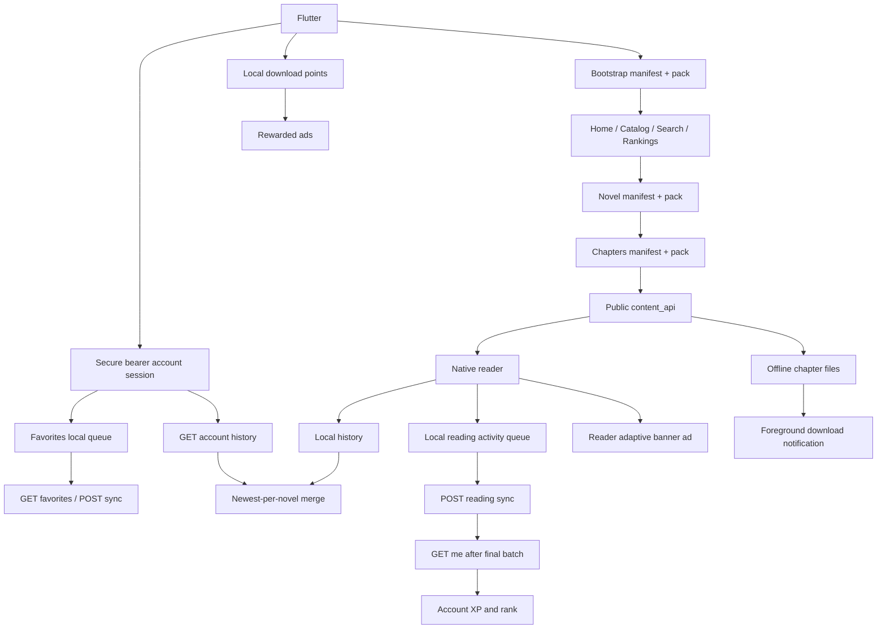

# تدقيق حالة التطبيق والـ API

تاريخ آخر تحديث: 3 يوليو 2026

## الهدف

هذا الملف يطابق بين:

- تطبيق Flutter الحالي.
- وثيقة `GALAXY_NOVELS_APP_API.md`.
- قالب Wor Reader v2491.
- الاستجابات الحية من `https://galaxynovels.com`.

الهدف هو معرفة ما نُفذ فعلا، وما هو موجود كواجهة فقط، وما يزال يحتاج دعما في التطبيق أو القالب.

## ترتيب مصادر الحقيقة

عند التعارض نعتمد الترتيب التالي:

1. استجابة الموقع الحية.
2. كود قالب v2491، خصوصا `inc/app-api.php` و`inc/app-cache.php`.
3. وثائق v2491.
4. وثيقة التطبيق الرئيسية والخطط القديمة.

وثيقة `docs/current_api_workflow.md` قديمة في جزء القارئ؛ تصف WebView، بينما v2491 والموقع الحي يقدمان `content_api` عامًا ومكاشى، والتطبيق يستخدمه في قارئ Native.

## الوضع الحي المؤكد

تم التحقق باستخدام User-Agent الرسمي `WorReaderApp/1.0 Android`:

- Bootstrap الثابت يعمل ويعلن `native_chapter_content_api: true`.
- `/wp-json/wor-reader-app/v1/bootstrap` عام ومكاشى عبر Cloudflare.
- `/wp-json/wor-reader-app/v1/chapters/{id}` يعيد JSON عامًا ومكاشى لمدة أسبوع على الـ edge.
- `/session` يعمل دون تسجيل دخول ويعيد `logged_in: false`.
- `/me` محمي ويعيد `401` دون جلسة.
- تسجيل دخول التطبيق يستخدم `auth_method: bearer` و`access_token`.
- الطلبات الخاصة في التطبيق تعتمد `Authorization: Bearer` و`X-Wor-App-Token`، ولا تعتمد على WordPress cookies أو `X-WP-Nonce`.
- قراءة التعليقات العامة تعمل دون تسجيل دخول.
- التقييم الشخصي محمي ويحتاج جلسة.
- Store العام مفعّل ويحتوي خطة واحدة وقت التدقيق.
- قالب VIP المحدث أضاف مسار محتوى فصول VIP: `GET /wp-json/wor-reader-app/v1/vip/chapters/{chapter_id}` مع Bearer token.

## التدفق المنفذ حاليا

## مصفوفة التنفيذ العام

| المجال | الحالة | الملاحظات |
|---|---|---|
| Bootstrap وبيانات الموقع | منفذ | يقرأ site وapi وروابط manifests وfeature flags الأساسية. |
| الرئيسية | منفذ | الرفوف تعمل، وأكمل القراءة يعتمد أحدث سجل محلي، وآخر التحديثات تفتح أحدث فصل في القارئ Native. |
| المكتبة | منفذ | تحميل تدريجي، بحث محلي/عام، فلاتر وترتيب وفتح التفاصيل. |
| البحث العام | منفذ | يعتمد search manifest/index ولا يرسل REST أثناء الكتابة. |
| الترتيب | منفذ | يعرض ترتيب الشهر ويفتح تفاصيل الرواية. |
| تفاصيل الرواية | منفذ | البيانات والقراءة والتنزيل والمفضلة والتقييم الشخصي وتبويب التعليقات العامة وكتابة التعليقات والردود والتصويت والتفاعلات تعمل. تعرض شاشة التفاصيل أول 50 فصل فقط من قائمة موحدة تضم الفصول العامة وVIP عند توفرها، مع زر شاشة "كل الفصول" بترقيم صفحات 50 فصل لكل صفحة. فصول VIP تفتح داخل القارئ Native عبر `vip/chapters/{chapter_id}` أو `content_api` القادم من السيرفر. |
| فهرس الفصول | منفذ | يستخدم chapters manifest/pack و`content_api`. |
| القارئ Native | منفذ | يعرض HTML القادم داخل JSON كعناصر Flutter، بدون WebView. يحتوي طبقة أزرار عائمة، وإعلان adaptive banner أعلى الفصل يمكن إخفاؤه للفصل الحالي فقط ويعود عند الانتقال لفصل آخر. |
| الكاش العام | منفذ | ملفات عامة محليا مع fallback عند فشل الشبكة. |
| التنزيلات | منفذ | التخزين والدفعات والقراءة المحلية وفتح الفصول والحذف وعرض المساحة تعمل. نافذة التحميل تدعم آخر 10، آخر 50، غير المحمل، واختيار نطاق بالأرقام مثل 158 إلى 203. يوجد overlay داخل التطبيق وإشعار Android foreground لتقدم الدفعات. الاستكمال بعد قتل عملية التطبيق غير منفذ كاستعادة مهمة شبكة كاملة. |
| سجل القراءة | منفذ | يسجل آخر فصل محليا، ويدمج الأحدث لكل رواية مع `GET /me/history`، ويحفظ نشاط الحساب في queue دائمة ثم يرسله إلى `/reading/sync`. تفاصيل سجل رواية واحدة ما زالت غير موصولة لأنها ليست مطلوبة لصفحة المتابعة الحالية. |
| إعدادات التطبيق والقارئ | منفذ | حجم الخط وتباعد الأسطر ووضع القراءة محفوظة محليا، وتعمل من القارئ ومن وجهة الإعدادات في القائمة الجانبية. شاشة الإعدادات تحتوي اختيار ثيمات محفوظ عبر SharedPreferences: حسب النظام، الفضاء السحيق، الكسوف القرمزي، رائد الصحراء، سديم التوت الأزرق، Galaxy Noir، وStarlight Paper. |
| المفضلة | منفذ | شاشة حسابية في القائمة الجانبية وزر حقيقي في التفاصيل، مع cache محلي معزول لكل مستخدم ومزامنة مؤجلة عند انقطاع الاتصال. |
| VIP schedule العام | منفذ | الرابط الموجود في بيانات الرواية يستخدم لإظهار تبويب VIP. القائمة نفسها تأتي من المسار الخاص `vip/chapters` وتتطلب Bearer token. |
| Store config العام | غير منفذ | الرابط مقروء من bootstrap فقط. |
| التعليقات العامة | منفذ | تعليقات الرواية والفصل تعمل عبر repository وcontroller موحدين، مع pagination صريح، أربعة ترتيبات، ردود، حرق، حالات فراغ وفشل غير حاجب. لا يبدأ الطلب قبل فتح التبويب أو لوحة القارئ. |
| الإعلانات | منفذ محليا | AdMob مضاف بإعلانات اختبارية: adaptive banner داخل القارئ وrewarded ads داخل صفحة التنزيلات. يحتاج قبل النشر استبدال IDs الاختبارية وإكمال إعدادات المتجر والخصوصية. |
| نقاط التنزيل | منفذ محليا | رصيد محلي محفوظ على الجهاز. كل إعلان مكافأة يمنح 25 نقطة، بحد 6 إعلانات يوميا، وكل فصل تحميل يكلف نقطة واحدة. لا يوجد تزامن مع حساب المستخدم أو حماية سيرفرية حاليا. |

## مصفوفة REST الخاص

| المجال | Endpoints | حالة التطبيق |
|---|---|---|
| الجلسة | `POST /auth/login`, `POST /auth/logout`, `GET /session`, `GET /me` | منفذ. يعمل الدخول والخروج واستعادة `/session` وتحديث الملف من `/me`. يحفظ خيار "تذكرني" `access_token` فقط داخل `flutter_secure_storage`. يرسل التطبيق `Authorization: Bearer` و`X-Wor-App-Token` في الطلبات الخاصة، ولا يرسل WordPress cookies أو `X-WP-Nonce`. يحمي التحديث من تبديل الجلسة، ويدمج طلبات الملف المتزامنة مع cooldown مدته 60 ثانية. |
| حالة الرواية للمستخدم | `GET /me/novels/{novel_id}` | منفذ. تحمل شاشة التفاصيل الحالة للمستخدم المسجل فقط، وتحمي النتيجة من تبديل الحساب، وتعرض التقييم الشخصي وVIP الفعال. إذا طابق `last_read.chapter_id` فصلا عاما متاحا يتحول زر القراءة إلى متابعة ذلك الفصل داخل القارئ الأصلي. تبقى المفضلة المحلية ذات pending sync هي المصدر النهائي لزر المفضلة. |
| المفضلة | `GET /me/favorites`, `POST /me/favorites/sync` | منفذ. يجلب قائمة الحساب، يطبق الإضافة والحذف تفاؤليا، يضغط آخر تغيير لكل رواية، ويرسل الدفعات بحد أقصى 50 تغييرا ثم يصالح الحالة مع السيرفر. التغييرات غير المرسلة محفوظة محليا لكل user ID، وحد القائمة مطابق للقالب: 300 رواية. |
| السجل البعيد | `GET /me/history`, `GET /me/history/novel/{id}` | منفذ. قائمة `/me/history` مدمجة مع السجل المحلي ومعزولة حسب الحساب. عند فتح تفاصيل رواية، يطلب التطبيق `/me/history/novel/{id}` بعد حالة الرواية الخاصة ويستخدم آخر فصل صالح منه لزر "متابعة القراءة"، مع الرجوع إلى `last_read` من `/me/novels/{id}` إذا تعذر endpoint السجل المفصل. بيانات السيرفر لا تعطي إجمالي فصول الرواية، لذلك لا يحسب التطبيق منها نسبة إنجاز زائفة. |
| نشاط القراءة وXP | `POST /reading/sync` | منفذ. القارئ يقيس foreground open time والنشاط لمدة 60 ثانية بعد التفاعل، ويحفظ أحداثا ثابتة معزولة لكل user ID، ويرسل حتى 50 حدثا في الدفعة مع منع التكرار وoffline retry. بعد قبول آخر دفعة وتفريغ queue محليا، يحدث التطبيق `/me` ويعرض XP الإجمالي وXP اليوم والرتبة والفصول المقروءة من السيرفر دون حساب محلي. |
| التقييمات | `GET/POST /ratings/novel/{id}` | منفذ عمليا دون طلب مكرر. يقرأ التطبيق `my_rating` من `GET /me/novels/{id}` عند فتح التفاصيل، لذلك لا يرسل `GET /ratings` إضافيا. يرسل التقييم من نجمة إلى خمس عبر `POST /ratings/novel/{id}`، ويطبق فقط القيمة التي يعيدها السيرفر، مع معالجة انتهاء الجلسة و`429`. |
| التعليقات | `GET/POST /comments/{type}/{id}` | منفذ. `GET` العام منفذ للرواية والفصل. `POST` للتعليقات والردود منفذ للمستخدم المسجل عبر Bearer token مع معالجة انتهاء الجلسة. |
| التصويت والتفاعل | `POST /comments/{comment_id}/vote`, `POST /comments/{novel|chapter}/{id}/reaction` | منفذ. يدعم لايك/ديسلايك للتعليقات وتفاعلات الهدف الستة للمستخدم المسجل، ويطبق أرقام `counts` القادمة من السيرفر مع معالجة انتهاء الجلسة. |
| VIP الخاص | chapters وchapters/{id} وcontinuous-next وlibrary-counts | منفذ للقراءة. `vip/chapters` موصول عبر `PrivateVipRepository` ويظهر في تفاصيل الرواية للمستخدم المصرح له. محتوى فصل VIP يفتح داخل القارئ Native عبر `GET /vip/chapters/{chapter_id}` أو `content_api` القادم من القائمة. `vip/continuous-next` ما زال مدعوما كـ fallback قديم فقط. لا توجد تنزيلات VIP ولا دفع داخل التطبيق. |
| الدفع والاشتراك | مسارات store الخاصة | غير منفذ ومؤجل. Store العام مقروء فقط على مستوى bootstrap، ولا توجد شاشة شراء أو ربط دفع داخل التطبيق. |
| جوائز المترجمين | `POST /translator-awards/vote` | غير منفذ ومؤجل. |

## فجوات داخل التطبيق لا تحتاج API جديدا

1. مدير التنزيل يستمر عند التنقل داخل التطبيق، لكنه لا يستعيد مهمة شبكة جارية بعد قتل عملية التطبيق أو إعادة تشغيل الهاتف.
2. يجب استبدال وحدات AdMob الاختبارية بوحدات إنتاج قبل أي نشر حقيقي.
3. لا تظهر داخل التطبيق إجراءات إنشاء حساب أو استعادة كلمة المرور؛ لا توجد endpoints موثقة لها في app API الحالي.

## فجوات تحتاج قرارا أو دعما إضافيا

- لا توجد endpoints في namespace الحالي لإنشاء حساب أو استعادة كلمة المرور. لا يجب إضافة أزرار native لها قبل توفير مسارات موثقة.
- تعديل الاسم والصورة موجود في namespace قديم `wor-reader/v1/account/*` وليس ضمن app API الموحد.
- نظام نقاط التنزيل الحالي محلي على الجهاز. إذا أردناه مرتبطا بالحساب، يحتاج endpoint منفصل خفيف للرصيد، سجل المكافآت، حدود اليوم، ومنع التحايل.
- الإشعارات الفورية غير موجودة في الـAPI الحالي وتحتاج FCM/APNs وبنية تسجيل device tokens.
- VIP content لا يجوز حفظه مثل الفصول العامة دون سياسة انتهاء وحذف مرتبطة بالاشتراك. التطبيق الحالي يقرأ فصول VIP فقط ولا يخزنها في التنزيلات.
- ملاحظة تنفيذ VIP: كان المسار القديم `vip/chapter?chapter_id=ID` غير موجود في اختبار 26 يونيو 2026. بعد تعديل القالب في 27 يونيو 2026، يعتمد التطبيق المسار الجديد `vip/chapters/{chapter_id}` ويدعم `content_api` القادم من قائمة الفصول.

## ترتيب التنفيذ المعتمد

### المرحلة 1: إكمال دورة القراءة المحلية

1. إكمال شاشة التنزيلات وعمليات الفتح والحذف. (مكتمل)
2. حفظ إعدادات القارئ وربط شاشة الإعدادات. (مكتمل)
3. ربط أكمل القراءة وآخر التحديثات بالتنقل الحقيقي. (مكتمل)
4. تحسين أداء قائمة الفصول الطويلة والبحث داخلها. (مكتمل)
5. تحسين التحميل الجماعي: آخر 10/50، غير المحمل، واختيار نطاق أرقام الفصول. (مكتمل)

هذه المرحلة لا تحتاج تسجيل دخول، وتغلق وظائف ظاهرة للمستخدم لكنها ناقصة حاليا.

### المرحلة 2: أساس الجلسة والحساب

1. `PrivateApiClient` موحد لـBearer token و`no-store`، ويأخذ User-Agent من `AppConfig`. (مكتمل)
2. `AuthRepository` مع restore session وتسجيل الدخول والخروج. (مكتمل)
3. تخزين آمن اختياري لـ`access_token`، ومعالجة 401 ضمن دورة الحساب. (مكتمل)
4. شاشة حساب فعلية وحالات ضيف/تحميل/خطأ/مسجل. (مكتمل)

### المرحلة 3: بيانات المستخدم والمزامنة

1. المفضلة مع queue محلية ومزامنة مجمعة. (مكتمل)
2. دمج السجل المحلي والبعيد بدون فقدان الأحدث. (مكتمل لقائمة `GET /me/history`)
3. queue لأحداث القراءة وإرسال `/reading/sync` على دفعات. (مكتمل)
4. إظهار XP القادم من السيرفر دون حسابه محليا. (مكتمل)

### المرحلة 4: التفاعل العام

1. عرض التعليقات العامة للرواية والفصل. (مكتمل)
2. إنشاء التعليقات والردود بعد تسجيل الدخول. (مكتمل)
3. التقييم الشخصي. (مكتمل)
4. التصويت والتفاعلات. (مكتمل)
5. عرض VIP schedule العام وفتح فصول VIP داخل القارئ Native. (مكتمل للقراءة فقط)
6. إضافة إعلان القارئ وإعلانات مكافأة نقاط التنزيل بصيغة محلية. (مكتمل بإعلانات اختبارية)

### المرحلة 5: VIP والمتجر

تأتي بعد استقرار الجلسة والمزامنة. فصول VIP للقراءة فقط منفذة الآن: القائمة وحالة الحساب وفتح الفصل داخل القارئ Native تعمل عبر مسار القالب الجديد. سياسة كاش VIP القصير والتنزيلات والدفع مؤجلة. نظام النقاط والإعلانات منفذ محليا للتنزيلات فقط، وليس نظام حسابات أو متجر.

## الخطوة التالية مباشرة

بعد نقطة الاستقرار الحالية، الخطوة التالية الأقرب هي تحسين دورة الحساب بالمسارات الموجودة فقط: توضيح تسجيل الدخول، تحديث بيانات الحساب من `/me`، تحسين رسائل انتهاء الجلسة، ثم بحث إمكانية تعديل الاسم والصورة أو عرضها من app namespace موحد إذا توفر endpoint موثق.
