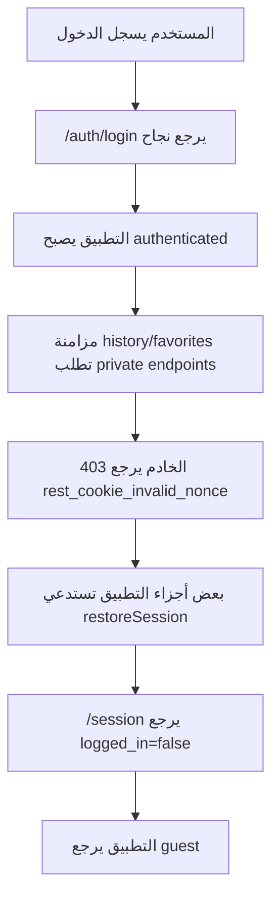

# تقرير مشكلة تسجيل الدخول والجلسة في تطبيق Galaxy Novels

تاريخ الفحص: 2026-06-26
النطاق: تطبيق Flutter + قالب Wor Reader على موقع `galaxynovels.com`

## النتيجة المختصرة

المشكلة ليست أن التطبيق يفشل في تسجيل الدخول. تسجيل الدخول ينجح فعلا، والخادم يرجع `logged_in: true` و nonce وبيانات المستخدم.

المشكلة الحقيقية أن مسارات الحساب الخاصة بعد تسجيل الدخول تعتمد على آلية WordPress التقليدية:

- cookies
- `X-WP-Nonce`
- `is_user_logged_in()`
- `wp_verify_nonce($nonce, 'wp_rest')`

هذه الآلية مناسبة أكثر لصفحات المتصفح داخل ووردبريس، لكنها غير مستقرة كتسجيل دخول native لتطبيق موبايل. لذلك بعد نجاح `/auth/login`، لا يستطيع `/wp-json/wor-reader-app/v1/session` إثبات الجلسة من نفس الكوكيز، ومسارات مثل `/me/history` و`/me/favorites` ترجع:

```text
rest_cookie_invalid_nonce
فشل التحقّق من ملف تعريف الارتباط
```

## ما تم اختباره

- [x] تشغيل التطبيق على emulator.
- [x] تسجيل الدخول بحساب اختبار من شاشة "حسابي".
- [x] مراقبة `adb logcat` أثناء تسجيل الدخول وبعد الخروج من صفحة الحساب.
- [x] اختبار نفس endpoints مباشرة خارج التطبيق باستخدام HTTP client.
- [x] فحص ملف القالب المسؤول عن REST API:
  `D:\Galaxy Novels\_codex_wor_reader_inspect\inc\app-api.php`
- [x] فحص ملف قواعد Cloudflare:
  `D:\Galaxy Novels\قواعد كلود فلير`

## دليل من المحاكي

ملف اللوج:

```text
D:\Galaxy Novels\galaxy_novels_app\.codex_logs\emulator_login_submit_20260626_150659.log
```

أهم ما ظهر:

```text
[GalaxyAuth] login:start remember=true
[GalaxyAuthApi] response POST /wp-json/wor-reader-app/v1/auth/login status=200 loggedIn=true nonce=true setCookie=4 cookieNow=true
[GalaxyAuth] state authenticating->authenticated
[GalaxyAuth] login:authenticated user=483 persist=true notice=false
```

هذا يثبت أن تسجيل الدخول نفسه ناجح.

بعدها مباشرة:

```text
[GalaxyAuthApi] response GET /wp-json/wor-reader-app/v1/me/history status=403 code=rest_cookie_invalid_nonce
[GalaxyAuthApi] response GET /wp-json/wor-reader-app/v1/me/favorites status=403 code=rest_cookie_invalid_nonce
```

هذا يثبت أن المشكلة تظهر بعد تسجيل الدخول عند استخدام المسارات الخاصة.

## دليل HTTP مباشر خارج التطبيق

تم اختبار نفس التدفق مباشرة:

1. `POST /wp-json/wor-reader-app/v1/auth/login`
2. حفظ الكوكيز التي أرجعها الخادم.
3. استخدام nonce الذي أرجعه login.
4. طلب `/session` و`/me/history`.

النتيجة:

```json
{
  "LoginStatus": 200,
  "LoginLoggedIn": true,
  "LoginNoncePresent": true,
  "CookieSummary": "[{\"Name\":\"wordpress_logged_in_8802c333164d08e4b44ef59b497b16ef\",\"Path\":\"/\",\"Secure\":true,\"Expired\":false},{\"Name\":\"wor_reader_login_hint\",\"Path\":\"/\",\"Secure\":true,\"Expired\":false}]",
  "SessionStatus": 403,
  "SessionCode": "rest_cookie_invalid_nonce",
  "HistoryStatus": 403,
  "HistoryCode": "rest_cookie_invalid_nonce",
  "HistoryMessage": "فشل التحقّق من ملف تعريف الارتباط"
}
```

وعند طلب `/session` بدون nonce بعد login:

```json
{
  "LoginStatus": 200,
  "LoginLoggedIn": true,
  "SessionNoNonceStatus": 200,
  "SessionNoNonceLoggedIn": false
}
```

المعنى: الخادم يسجل الدخول في رد `/auth/login`، لكنه في الطلب التالي لا يعتبر نفس الكوكيز جلسة ووردبريس صالحة لمسارات REST الخاصة بالتطبيق.

## أين المشكلة في القالب

الملف:

```text
D:\Galaxy Novels\_codex_wor_reader_inspect\inc\app-api.php
```

تسجيل المسارات الخاصة:

```php
register_rest_route(WOR_READER_APP_API_NAMESPACE, '/me/favorites', array(
    'permission_callback' => 'wor_reader_app_api_private_permission',
));

register_rest_route(WOR_READER_APP_API_NAMESPACE, '/me/history', array(
    'permission_callback' => 'wor_reader_app_api_private_permission',
));

register_rest_route(WOR_READER_APP_API_NAMESPACE, '/reading/sync', array(
    'permission_callback' => 'wor_reader_app_api_private_permission',
));
```

المسارات الخاصة تمر عبر:

```php
function wor_reader_app_api_private_permission(WP_REST_Request $request) {
    if (!is_user_logged_in() || !current_user_can('read')) {
        return new WP_Error('wor_reader_app_login_required', __('سجّل الدخول أولًا.', 'wor-reader'), array('status' => 401));
    }

    $nonce = wor_reader_app_api_nonce_from_request($request);
    if (!$nonce || !wp_verify_nonce($nonce, 'wp_rest')) {
        return new WP_Error('wor_reader_app_bad_nonce', __('انتهت الجلسة. حدّث الصفحة وحاول مرة أخرى.', 'wor-reader'), array('status' => 403));
    }

    return true;
}
```

وتسجيل الدخول الحالي:

```php
function wor_reader_app_api_login(WP_REST_Request $request) {
    $user = wp_signon(array(
        'user_login' => $username,
        'user_password' => $password,
        'remember' => $remember,
    ), is_ssl());

    wp_set_current_user($user->ID);

    return wor_reader_app_api_no_store_response(array(
        'logged_in' => true,
        'nonce' => wp_create_nonce('wp_rest'),
        'user' => wor_reader_app_api_user_payload($user->ID),
    ));
}
```

و `/session` الحالي:

```php
function wor_reader_app_api_session(WP_REST_Request $request) {
    if (!is_user_logged_in()) {
        return wor_reader_app_api_no_store_response(array('logged_in' => false));
    }

    return wor_reader_app_api_no_store_response(array(
        'logged_in' => true,
        'nonce' => wp_create_nonce('wp_rest'),
        'user' => wor_reader_app_api_user_payload(get_current_user_id()),
    ));
}
```

المشكلة هنا أن `/session` و private routes لا تملك طريقة native مستقلة لإثبات مستخدم التطبيق. هي تنتظر أن يتصرف التطبيق مثل متصفح ووردبريس كامل، وهذا هو موضع الخلل.

## علاقة Cloudflare

ملف قواعد Cloudflare يقول صراحة إن `/wp-json/` يجب أن يكون bypass/no-store:

```text
or starts_with(http.request.uri.path, "/wp-json/")
Settings:
- Cache eligibility: Bypass cache
```

لذلك Cloudflare ليس السبب المباشر في هذا الخطأ. الطلب يصل إلى WordPress فعلا، والدليل أن الرد هو خطأ WordPress REST أساسي:

```text
rest_cookie_invalid_nonce
```

لكن يجب التأكد عند النشر أن قواعد Cloudflare لا تكاشي أو تعدل أي مسار تحت:

```text
/wp-json/wor-reader-app/v1/
```

## لماذا كان التطبيق يرجع كأنه لم يسجل دخول

قبل التحصين داخل التطبيق كان يحدث هذا التسلسل:



تم تحصين التطبيق حتى لا يهبط من `authenticated` إلى `guest` بسبب فشل مزامنة خلفية، لكن هذا لا يحل أصل المشكلة في الخادم. أصل المشكلة أن private API نفسها لا تقبل جلسة التطبيق.

## الحل الصحيح المقترح

الحل الأفضل: إضافة نظام جلسة خاص بتطبيق الموبايل داخل القالب، يعتمد على bearer token بدل الاعتماد على WordPress cookie nonce.

### الفكرة

عند نجاح `/auth/login`:

1. يتحقق القالب من اسم المستخدم وكلمة المرور عبر WordPress.
2. ينشئ token عشوائي قوي.
3. يخزن hash للتوكن مع `user_id` ووقت الانتهاء.
4. يرجع للتطبيق:

```json
{
  "logged_in": true,
  "token_type": "bearer",
  "access_token": "...",
  "expires_at": "...",
  "user": {}
}
```

بعدها يرسل التطبيق:

```text
Authorization: Bearer <access_token>
User-Agent: WorReaderApp/1.0 Android
```

بدل الاعتماد على:

```text
Cookie: wordpress_logged_in_...
X-WP-Nonce: ...
```

### ما يتغير في القالب

إضافة دوال مثل:

```php
wor_reader_app_api_issue_token($user_id)
wor_reader_app_api_hash_token($token)
wor_reader_app_api_validate_bearer_token(WP_REST_Request $request)
wor_reader_app_api_revoke_token(WP_REST_Request $request)
```

وتعديل:

```php
wor_reader_app_api_private_permission()
```

حتى يقبل:

1. bearer token لتطبيق الموبايل.
2. وربما cookie + nonce للمتصفح إذا أردنا الحفاظ على توافق الويب.

عند نجاح token validation:

```php
wp_set_current_user($user_id);
```

ثم تستخدم دوال القالب الحالية `get_current_user_id()` بشكل طبيعي.

### تخزين الجلسة

الأفضل إنشاء جدول صغير:

```text
wp_wor_reader_app_sessions
```

حقول مقترحة:

```text
id
user_id
token_hash
created_at
expires_at
last_used_at
device_label
revoked_at
```

بديل سريع: user meta أو transient، لكنه أقل وضوحا للإدارة والتنظيف مستقبلا.

### الأمان

- لا نخزن token نفسه، نخزن hash فقط.
- مدة صلاحية مبدئية: 30 يوم مع `remember=true`.
- logout يحذف أو يلغي token الحالي.
- يمكن لاحقا إضافة قائمة الأجهزة أو زر "تسجيل خروج من كل الأجهزة".
- private API يبقى `no-store`.
- Cloudflare يبقى bypass لكل `/wp-json/wor-reader-app/v1/*`.

## حل بديل أقل تفضيلا

يمكن محاولة إصلاح cookie + nonce عبر:

- إجبار cookie path يغطي `/wp-json`.
- توليد nonce بعد تثبيت session token بشكل صحيح.
- جعل `/session` يعيد nonce جديد من cookie موثق.
- التأكد من `SameSite` و`Secure` وdomain.

لكن هذا الحل يظل حساسا؛ لأنه يحاول جعل native app يتصرف مثل browser WordPress. لذلك لا أوصي به كأساس طويل المدى.

## ما يحتاجه التطبيق بعد تعديل القالب

تعديل `PrivateApiClient` ليعمل كالتالي:

1. يخزن `access_token` من login.
2. يضيف:

```text
Authorization: Bearer <token>
```

في private requests.

3. يجعل `/session` يتحقق من token.
4. يبقي fallback الحالي للكوكيز مؤقتا فقط إن احتجنا انتقالا تدريجيا.
5. لاحقا يمكن نقل تخزين token إلى secure storage قبل إصدار production.

## خطة تنفيذ مقترحة

1. تعديل قالب Wor Reader لإضافة app bearer sessions.
2. تعديل `/auth/login` ليعيد `access_token` بجانب `user`.
3. تعديل `/session` ليقبل bearer token ويرجع `logged_in=true`.
4. تعديل `wor_reader_app_api_private_permission()` لقبول token.
5. تعديل تطبيق Flutter لاستخدام `Authorization` بدل `X-WP-Nonce` لمسارات الحساب.
6. اختبار:
   - login
   - session restore بعد إغلاق التطبيق وفتحه
   - favorites sync
   - history sync
   - reading sync
   - logout

## معايير نجاح الإصلاح

- بعد login مباشرة:

```text
POST /auth/login => 200 logged_in=true access_token=true
GET /session + Authorization => 200 logged_in=true
GET /me/history + Authorization => 200
GET /me/favorites + Authorization => 200
POST /reading/sync + Authorization => 200
```

- الخروج من صفحة "حسابي" والعودة إليها لا يحول المستخدم إلى guest.
- إغلاق التطبيق وفتحه يعيد الحساب بدون طلب تسجيل دخول جديد.
- فشل مزامنة خلفية لا يخرج المستخدم من الحساب.

## القرار الفني

لا نبني إصدار الإنتاج على WordPress REST cookie nonce للتطبيق.
نبني طبقة app session token بسيطة داخل القالب ونترك ملفات الكاش العامة كما هي للبيانات العامة والفصول العامة.

هذا يحل المشكلة الحالية، ويجهزنا لاحقا لنظام النقاط، التنزيلات، المفضلة، السجل، التعليقات، وVIP بدون ربط التطبيق بسلوك متصفح ووردبريس.
