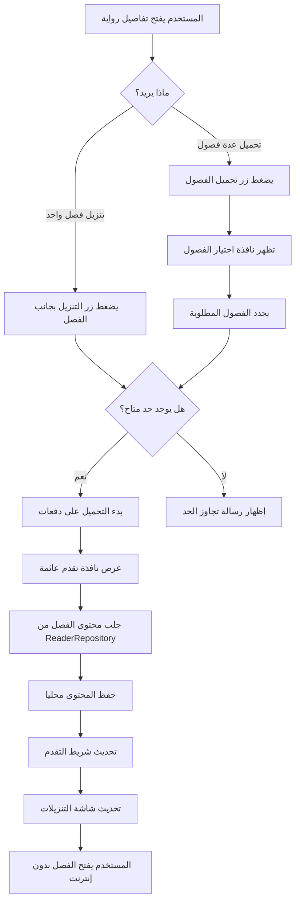
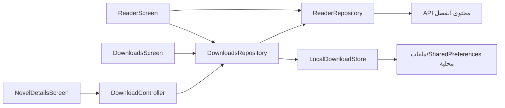
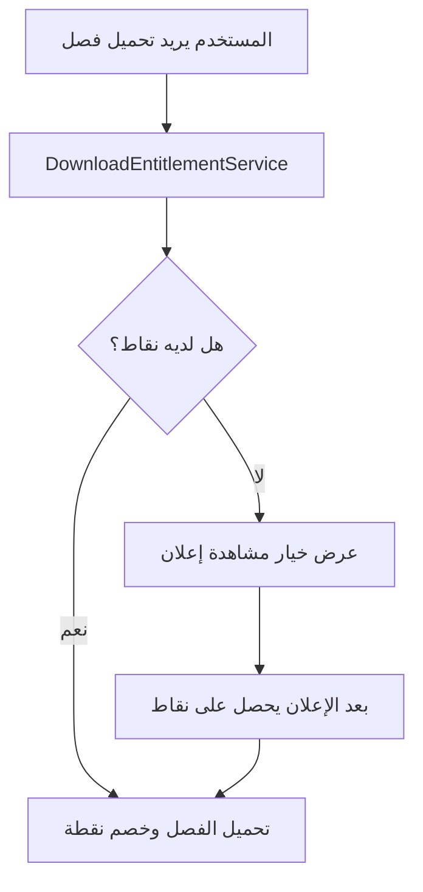

# خطة نظام التنزيلات في تطبيق مجرة الروايات

## الهدف

نريد إضافة نظام تنزيل فصول للروايات يسمح للمستخدم بقراءة الفصول بدون إنترنت داخل القارئ النيتيف الحالي، مع تجهيز البنية مبكرا لنظام نقاط وإعلانات في المستقبل.

النظام في المرحلة الأولى يجب أن يكون واضحا وخفيفا:

- زر تنزيل فردي بجانب كل فصل.
- زر `تحميل الفصول` داخل صفحة تفاصيل الرواية.
- نافذة اختيار فصول للتحميل الجماعي.
- شاشة `التنزيلات` في الشريط السفلي.
- حد مؤقت قدره `100` فصل محمل إجمالا على الجهاز.
- لا يوجد نظام نقاط أو إعلانات فعلي الآن، لكن التصميم لا يغلق الباب أمامهما.

## نطاق المرحلة الأولى

### داخل النطاق

- إنشاء تبويب سفلي جديد باسم `التنزيلات`.
- إنشاء شاشة تنزيلات تعرض الفصول والروايات المحملة.
- تنزيل فصل واحد من صفحة تفاصيل الرواية.
- فتح نافذة تحميل جماعي من صفحة تفاصيل الرواية.
- إظهار نافذة تقدم عائمة صغيرة بعد بدء التحميل الجماعي.
- تحميل الفصول على دفعات داخلية حتى لو اختار المستخدم عددا كبيرا.
- حفظ محتوى الفصل محليا بصيغة يستطيع القارئ النيتيف قراءتها.
- جعل القارئ يقرأ من التخزين المحلي إذا كان الفصل محملا.
- عرض حد التنزيل الحالي بوضوح: `المستخدم حمل X من 100 فصل`.
- منع تحميل فصول جديدة عند الوصول إلى الحد.
- إتاحة حذف فصل أو حذف تنزيلات رواية.

### خارج النطاق حاليا

- نظام تسجيل دخول.
- شراء نقاط.
- ربط إعلانات فعلي.
- مزامنة التنزيلات بين الأجهزة.
- تحميل تلقائي لفصول جديدة.
- تحميل رواية كاملة بزر واحد بدون نافذة اختيار.
- تنزيل الصور الداخلية إن ظهرت لاحقا داخل الفصل.
- تشغيل التحميل في الخلفية بعد إغلاق التطبيق بالكامل.

## قاعدة الحد المؤقت

الحد الحالي هو `100` فصل إجمالي على الجهاز، وليس `100` فصل لكل رواية.

سبب هذا القرار:

- أسهل للمستخدم أن يفهمه.
- يقلل ضغط السيرفر في المرحلة الأولى.
- يجهزنا لنظام النقاط لاحقا.
- يمنع تضخم التخزين المحلي بدون إدارة معقدة.

عندما يتم إضافة النقاط لاحقا، يمكن تحويل هذا الحد إلى:

- حد مجاني افتراضي.
- أو حد مؤقت قبل تسجيل الدخول.
- أو حد fallback إذا لم يكن نظام النقاط متاحا.

## تجربة المستخدم

### الشريط السفلي

يصبح ترتيب الشريط السفلي المقترح:

1. الرئيسية
2. المكتبة
3. التنزيلات
4. السجل
5. الترتيب

`حسابي` يبقى في القائمة الجانبية كما اتفقنا سابقا.

### تفاصيل الرواية

في صفحة تفاصيل الرواية تظهر عناصر التنزيل في مكانين:

1. زر عام باسم `تحميل الفصول`.
2. زر تنزيل صغير بجانب كل فصل.

زر `تحميل الفصول` يفتح نافذة كبيرة عائمة من الأسفل. هذه النافذة لا تنقل المستخدم إلى صفحة جديدة، حتى يبقى داخل سياق الرواية.

### نافذة تحميل الفصول

النافذة تعرض:

- اسم الرواية.
- عداد الحد: `تم تحميل 24 / 100 فصل`.
- عدد الفصول المحددة حاليا.
- قائمة فصول الرواية.
- حالة كل فصل:
  - غير محمل.
  - محدد للتحميل.
  - محمل.
  - فشل التحميل.
- أزرار مساعدة:
  - تحديد آخر 10 فصول.
  - تحديد غير المحمل فقط.
  - إلغاء التحديد.
  - بدء التحميل.

إذا اختار المستخدم عددا يتجاوز الحد المتبقي، لا يبدأ التحميل، وتظهر رسالة واضحة:

> لا يمكنك تحميل هذا العدد الآن. الحد الحالي 100 فصل، والمتبقي لديك N فصل.

### نافذة تقدم التحميل

بعد أن يضغط المستخدم زر `تحميل` داخل نافذة اختيار الفصول، تغلق نافذة الاختيار أو تنكمش، وتظهر نافذة عائمة صغيرة في منتصف الشاشة.

هذه النافذة تعرض:

- صورة مصغرة لغلاف الرواية.
- اسم الرواية.
- عدد الفصول التي يتم تحميلها.
- شريط تقدم واضح.
- نص حالة مثل: `جاري تحميل 7 من 24`.
- زر صغير لإخفاء النافذة مع استمرار التحميل داخل التطبيق.

النافذة ليست صفحة كاملة وليست ثقيلة بصريا. الهدف منها طمأنة المستخدم أن التحميل بدأ فعلا، خصوصا عند تحميل دفعات كبيرة.

عند اكتمال التحميل:

- تتحول الحالة إلى `اكتمل تحميل 24 فصل`.
- يظهر زر `فتح التنزيلات`.
- تختفي النافذة تلقائيا بعد مدة قصيرة إذا لم يتفاعل المستخدم معها.

إذا فشل بعض الفصول:

- تعرض النافذة نتيجة مختصرة مثل: `تم تحميل 21 فصل، فشل 3`.
- يظهر زر `إعادة محاولة` للفصول الفاشلة.
- لا يتم حذف الفصول التي نجحت.

### شاشة التنزيلات

شاشة التنزيلات تعرض:

- عداد أعلى الشاشة: `X / 100 فصل محمل`.
- رسالة صغيرة تشرح أن الحد مؤقت إلى حين تفعيل النقاط.
- قائمة روايات محملة.
- داخل كل رواية:
  - الغلاف.
  - اسم الرواية.
  - عدد الفصول المحملة.
  - آخر فصل تم فتحه إن وجد.
  - زر متابعة القراءة.
  - زر إدارة أو حذف.

إذا لم توجد تنزيلات:

- تظهر حالة فارغة محترمة.
- النص المقترح: `الفصول التي تحملها ستظهر هنا للقراءة بدون إنترنت`.
- زر يفتح المكتبة.

## Workflow المستخدم

## Workflow البيانات

القارئ يستخدم المنطق التالي:

1. يستقبل `contentApi` كالمعتاد.
2. يسأل `DownloadsRepository` هل هذا الفصل محمل؟
3. إذا كان محملا، يقرأ المحتوى المحلي.
4. إذا لم يكن محملا، يستخدم `ReaderRepository` لجلبه من الشبكة.

## بنية البيانات المقترحة

### DownloadedChapter

يمثل فصل محمل واحد:

- `novelId`
- `novelTitle`
- `novelCover`
- `chapterId`
- `chapterTitle`
- `chapterLabel`
- `chapterPosition`
- `chaptersTotal`
- `contentApi`
- `html`
- `plainTextPreview`
- `downloadedAt`
- `lastOpenedAt`

### DownloadedNovel

يمثل تجميعا مشتقا من الفصول المحملة:

- `novelId`
- `title`
- `cover`
- `downloadedChaptersCount`
- `lastOpenedChapter`
- `latestDownloadAt`

لا نحتاج تخزين `DownloadedNovel` ككيان مستقل في البداية. يمكن اشتقاقه من قائمة الفصول المحملة، ثم نضيف تخزينا منفصلا إذا احتجنا أداء أعلى لاحقا.

## البنية البرمجية المقترحة

### طبقة البيانات

- `DownloadRepository`
  - `listChapters()`
  - `listNovels()`
  - `isDownloaded(contentApi)`
  - `downloadChapter(...)`
  - `downloadChaptersBatch(...)`
  - `deleteChapter(...)`
  - `deleteNovelDownloads(novelId)`
  - `remainingSlots()`

- `LocalDownloadStore`
  - مسؤول عن التخزين المحلي فقط.
  - لا يعرف شيئا عن الواجهة.

- `DownloadLimitPolicy`
  - يحتوي حد `100`.
  - لاحقا يستبدل أو يتوسع ليدعم النقاط والإعلانات.

### طبقة الواجهة

- `DownloadsScreen`
- `DownloadChaptersSheet`
- `DownloadProgressOverlay`
- `ChapterDownloadButton`
- تحديث `NovelChapterTile` لإظهار زر التنزيل.
- تحديث `ReaderScreen` لقراءة المحتوى المحلي عند توفره.

## التحميل على دفعات

حتى لو اختار المستخدم 80 فصلا، لا يتم تشغيل 80 طلبا دفعة واحدة.

السلوك المقترح:

- تحميل متسلسل أو بتوازي محدود جدا.
- الحد الأولي: `2` طلبات في نفس الوقت كحد أقصى.
- تحديث حالة كل فصل أثناء التحميل.
- تحديث نافذة التقدم العائمة بعد كل فصل.
- إذا فشل فصل، لا يوقف كل العملية.
- بعد انتهاء الدفعة، تعرض النافذة:
  - عدد الفصول التي نجحت.
  - عدد الفصول التي فشلت.
  - زر إعادة محاولة للفاشلة.

## تجهيز النقاط والإعلانات لاحقا

لا نضيف نقاط الآن، لكن نترك أماكن واضحة في التصميم:

- `DownloadEntitlementService`
  - حاليا يرجع أن المستخدم يستطيع التحميل إذا لم يتجاوز حد `100`.
  - لاحقا يمكنه فحص النقاط أو حالة الإعلان.

- `DownloadLimitPolicy`
  - حاليا ثابت.
  - لاحقا يمكن أن يقرأ من إعدادات السيرفر أو حساب المستخدم.

مثال مستقبلي:

## حالات الخطأ

- لا يوجد إنترنت:
  - عند التحميل: تظهر رسالة فشل ويمكن إعادة المحاولة.
  - عند القراءة: إذا الفصل محمل يفتح طبيعيا.

- الفصل لا يحتوي `contentApi`:
  - تعطيل زر التنزيل لهذا الفصل.
  - إبقاء زر القراءة حسب قدرة القارئ الحالية.

- امتلأ الحد:
  - تعطيل أزرار التحميل الجديدة.
  - إظهار المتبقي `0`.
  - توجيه المستخدم لحذف تنزيلات قديمة.

- نقص مساحة التخزين:
  - إظهار رسالة `لا توجد مساحة كافية لحفظ الفصل`.
  - عدم اعتبار الفصل محملا.

- فشل فصل داخل تحميل جماعي:
  - لا يتم حذف الفصول التي نجحت.
  - يظهر الفصل الفاشل بحالة فشل مع زر إعادة محاولة.

## متطلبات UI/UX

- الواجهة عربية بالكامل وRTL.
- لا نستخدم كروت كثيرة بلا داع.
- شاشة التنزيلات تكون عملية وغنية بصريا، لكن أخف من صفحات التفاصيل.
- أزرار التنزيل تستخدم أيقونات واضحة:
  - تنزيل.
  - محمل.
  - فشل.
  - حذف.
- نافذة التحميل الجماعي يجب أن تكون سهلة لمس الشاشة:
  - ارتفاع كبير.
  - قائمة قابلة للتمرير.
  - زر بدء التحميل ثابت في الأسفل.
- نافذة تقدم التحميل يجب أن تكون صغيرة وواضحة:
  - تظهر في منتصف الشاشة.
  - تحتوي غلاف الرواية واسمها.
  - تحتوي شريط تقدم ونص حالة.
  - لا تحجب التطبيق لفترة طويلة بعد اكتمال التحميل.
- لا نستخدم أنيميشن ثقيل.
- المسموح فقط:
  - تغير حالة الزر.
  - مؤشر تقدم بسيط.
  - انتقال خفيف للنافذة.

## الاختبارات المطلوبة

### Unit Tests

- حساب الحد المتبقي من `100`.
- منع التحميل عند تجاوز الحد.
- اعتبار الفصل محملا إذا وجد `contentApi`.
- حذف فصل يقلل العداد.
- تحميل دفعة يستمر عند فشل فصل واحد.

### Widget Tests

- ظهور تبويب `التنزيلات` في الشريط السفلي.
- شاشة التنزيلات الفارغة تعرض الرسالة الصحيحة.
- زر تحميل الفصل يظهر بجانب الفصل.
- نافذة تحميل الفصول تعرض العداد والاختيارات.
- نافذة تقدم التحميل تظهر بعد بدء التحميل الجماعي.
- نافذة تقدم التحميل تعرض الغلاف والاسم وشريط التقدم.
- منع بدء التحميل عند تجاوز الحد.
- القارئ يعرض المحتوى المحلي إذا كان موجودا.

### Manual QA

- تحميل فصل واحد.
- تحميل عدة فصول.
- التأكد من ظهور نافذة التقدم أثناء التحميل الجماعي.
- فتح الفصل بعد قطع الإنترنت.
- حذف فصل والتأكد من نزول العداد.
- محاولة تجاوز 100 فصل والتأكد من ظهور المنع.

## ترتيب التنفيذ المقترح

1. إضافة موديلات التنزيل و `DownloadLimitPolicy`.
2. إضافة `LocalDownloadStore` و `DownloadRepository`.
3. ربط repository داخل `AppDependencies`.
4. إضافة تبويب وشاشة `التنزيلات`.
5. إضافة زر تنزيل فردي داخل `NovelChapterTile`.
6. إضافة نافذة `DownloadChaptersSheet`.
7. إضافة نافذة `DownloadProgressOverlay`.
8. تعديل `ReaderScreen` للقراءة من المحتوى المحلي.
9. إضافة الاختبارات.
10. تشغيل:
   - `flutter analyze`
   - `flutter test`
   - `flutter build apk --debug`

## قرارات مثبتة

- الحد `100` فصل إجمالي على الجهاز.
- لا نقاط ولا إعلانات في المرحلة الأولى.
- القارئ يبقى نيتيف ولا نعود إلى WebView.
- التحميل الجماعي يتم من نافذة داخل تفاصيل الرواية.
- بعد بدء التحميل الجماعي تظهر نافذة تقدم عائمة في منتصف الشاشة.
- التنزيلات تحصل على تبويب سفلي مستقل.
- التخزين المحلي يكون منفصلا عن سجل القراءة، لكن يمكن للسجل أن يستفيد منه لاحقا.

## ملاحظات مستقبلية

- بعد نجاح المرحلة الأولى يمكن إضافة:
  - زر تحميل آخر 20 فصل.
  - تحميل تلقائي للفصل التالي أثناء القراءة.
  - فلتر داخل التنزيلات حسب الرواية أو آخر قراءة.
  - نظام نقاط كامل.
  - ربط إعلانات المكافأة.
  - حد مختلف للمستخدم المسجل أو الداعم.
