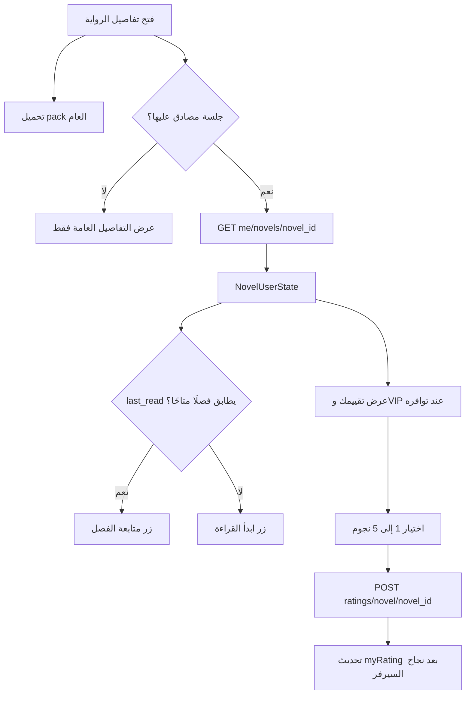

# تصميم حالة المستخدم والتقييم في تفاصيل الرواية

تاريخ الاعتماد: 24 يونيو 2026

## الهدف

ربط شاشة تفاصيل الرواية بحالة المستخدم الخاصة القادمة من `GET /me/novels/{novel_id}`، وإتاحة متابعة آخر فصل وتقييم الرواية من نجمة إلى خمس عبر `POST /ratings/novel/{novel_id}`، من دون تعطيل البيانات العامة أو خلط هذه المسؤوليات مع إدارة جلسة الحساب.

## النطاق

يشمل التنفيذ:

- جلب حالة الرواية للمستخدم المسجل فقط.
- قراءة `favorite` و`my_rating` و`last_read` وبيانات VIP من الاستجابة.
- تحويل زر القراءة إلى متابعة آخر فصل عندما يطابق الفصل المحفوظ فصلًا عامًا متاحًا.
- عرض التقييم الشخصي وإرساله من واجهة عربية بخمس نجوم.
- عرض شارة VIP صغيرة عندما تكون العضوية فعالة.
- معالجة انتهاء الجلسة، تحديد المعدل، أخطاء الشبكة، وتبديل الحساب أثناء الطلب.

لا يشمل التنفيذ:

- جلب الفصول الخاصة أو فتحها.
- تغيير متوسط التقييم العام محليًا بعد إرسال التقييم؛ فالـ API لا يعيد متوسطًا محدثًا.
- استبدال مزامنة المفضلة الحالية أو الكتابة فوق تغييراتها المحلية المعلقة.
- تخزين حالات جميع الروايات في cache عالمي.

## القرار المعماري

يستخدم التطبيق Repository مستقلًا لعمليات حالة الرواية والتقييم، مع Controller محلي لكل شاشة تفاصيل. لا تضاف هذه العمليات إلى `AuthRepository` لأن الجلسة مسؤولة عن هوية المستخدم ودورة تسجيل الدخول فقط.

### الوحدات

1. `NovelUserState`: نموذج ثابت يمثل حالة المستخدم مع رواية واحدة.
2. `NovelEngagementRepository`: عقد لجلب الحالة وإرسال التقييم.
3. `PrivateNovelEngagementRepository`: تنفيذ يعتمد على `PrivateApiClient` ويستخدم تجديد nonce الموجود.
4. `NovelEngagementController`: حالة واجهة محلية تدير التحميل والإرسال وتحمي الشاشة من نتائج الطلبات القديمة.
5. Widgets صغيرة داخل تفاصيل الرواية لعرض التقييم الشخصي واختيار النجوم.

كل وحدة ذات مسؤولية واحدة: النموذج يفسر البيانات، المستودع يتعامل مع الشبكة، الـ Controller ينسق دورة الشاشة، والـ widgets تعرض الحالة وتطلق الأوامر.

لا يرسل التطبيق `GET /ratings/novel/{novel_id}` عند فتح الشاشة لأن `GET /me/novels/{novel_id}` يعيد `my_rating` ضمن الاستجابة نفسها. هذا يمنع طلبًا خاصًا مكررًا ويخفف الحمل على السيرفر. يبقى إرسال التقييم عبر `POST /ratings/novel/{novel_id}`، ويمكن إضافة قراءة endpoint المنفصل لاحقًا فقط إذا تغير عقد حالة الرواية.

## تدفق البيانات



## عقد البيانات

النموذج يقبل الاستجابة التالية:

```json
{
  "novel_id": 123,
  "favorite": true,
  "my_rating": 4,
  "last_read": {
    "chapter_id": 555,
    "chapter_url": "/novel/example/chapter-1/",
    "progress": 96,
    "updated_at": "2026-06-18T10:00:00+00:00"
  },
  "vip": {
    "active": true,
    "can_read_private": true
  }
}
```

قواعد التطبيع:

- `novel_id` يجب أن يطابق الرواية المطلوبة ويكون أكبر من صفر.
- `my_rating` يقبل الأعداد من 0 إلى 5؛ الصفر يعني أن المستخدم لم يقيّم.
- `progress` يقص إلى المجال 0–100.
- `chapter_id` غير الصالح يتحول إلى صفر ولا ينتج زر متابعة.
- التاريخ غير الصالح يتحول إلى `null`.
- غياب الكائنات الاختيارية ينتج قيمًا آمنة بدل إسقاط الشاشة.

إرسال التقييم يستخدم:

```json
{
  "rating": 4
}
```

ولا يحدّث `myRating` محليًا إلا بعد أن يعيد السيرفر تقييمًا صالحًا من 1 إلى 5.

## سلوك الشاشة

### التحميل والجلسة

- يبدأ جلب الحالة بعد معرفة `novel_id` من بيانات الرواية العامة.
- لا ينفذ طلب خاص للمستخدم الضيف.
- عند تسجيل الدخول أو تبديل الحساب أثناء بقاء الشاشة مفتوحة، يعاد تحميل الحالة للحساب الجديد.
- عند تسجيل الخروج تمسح الحالة الشخصية فورًا وتظل تفاصيل الرواية العامة ظاهرة.
- النتيجة المتأخرة لا تطبق إذا تغير المستخدم أو الرواية أو أغلقت الشاشة.

### متابعة القراءة

- يبحث الـ Controller في الفصول المحملة عن `last_read.chapter_id`.
- عند وجود تطابق صالح، يستخدم زر الشريط السفلي النص `متابعة الفصل ...` ويفتح `effectiveContentApi` لذلك الفصل.
- عند عدم وجود تطابق، يبقى زر `ابدأ القراءة` على أول فصل عام قابل للقراءة.
- لا يحاول التطبيق تحويل `chapter_url` إلى API للفصل ولا يفتح WebView.

### المفضلة

تبقى `FavoritesRepository` المصدر النهائي لحالة زر المفضلة لأنها تدعم تغييرات محلية معلقة ومزامنة offline. تقرأ قيمة `favorite` في `NovelUserState` ضمن عقد السيرفر، لكنها لا تستبدل الحالة المحلية ولا تلغي pending mutation.

### التقييم

- تظهر منطقة مضغوطة باسم `تقييمك` لجميع المستخدمين؛ تعرض للضيف إجراء `سجّل الدخول للتقييم`، وتعرض للمستخدم المسجل تقييمه بعد اكتمال تحميل الحالة.
- الضغط عليه يفتح bottom sheet خفيفًا بخمس نجوم وأسماء وصول واضحة.
- يظل الاختيار الحالي محددًا عند إعادة الفتح.
- أثناء الإرسال تعطل أزرار النجوم ويظهر مؤشر صغير.
- بعد النجاح يغلق الـ sheet وتظهر رسالة `تم حفظ تقييمك`.
- الضيف يرى إجراء تسجيل دخول بدل إرسال طلب خاص.
- لا تستخدم animations مستمرة؛ الحركة تقتصر على انتقال الـ bottom sheet وحالة الضغط الافتراضية.

### VIP

تظهر شارة `عضوية VIP فعالة` فقط عندما تكون `vip.active` صحيحة. لا يظهر زر لفصل خاص ولا وعد بالوصول قبل تنفيذ API الفصول الخاصة.

## الأخطاء

- فشل `GET` غير حاجب: تختفي المنطقة الشخصية أو تعرض إعادة محاولة صغيرة، وتبقى الرواية والفصول متاحة.
- `401/403`: يطلب من `AuthRepository` إعادة فحص الجلسة، ولا تبقى حالة مستخدم قديمة في الشاشة.
- `429`: يعرض `محاولات كثيرة، حاول لاحقًا` ولا يغير التقييم المرئي.
- أخطاء الشبكة و`5xx`: تعرض رسالة عربية قابلة لإعادة المحاولة.
- payload غير صالح: يعامل كفشل بيانات ولا يطبق جزئيًا.

## الأداء وإمكانية الوصول

- لا يوجد cache عالمي أو polling أو طلب عند كل rebuild.
- توجد عملية تحميل واحدة وعملية إرسال واحدة لكل Controller، مع تعطيل الإرسال المتكرر.
- كل النجوم `IconButton` بحد لمس مناسب وtooltip من `نجمة واحدة` إلى `خمس نجوم`.
- النصوص تعمل مع RTL ومقياس الخط، وتختبر الشاشة بعرض 320 بكسل دون overflow.
- الألوان مأخوذة من `AppThemeTokens` ولا توجد ألوان hardcoded أو gradients.

## الاختبارات

ينفذ التطوير وفق Red-Green-Refactor ويغطي:

1. parsing الصحيح والقيم الناقصة ورفض `novel_id` المختلف.
2. مسار GET الصحيح، nonce، وإعادة المحاولة بعد nonce منتهي.
3. body مسار POST والتحقق من تقييم الاستجابة.
4. الضيف وتسجيل الدخول والخروج وتبديل الحساب أثناء الطلب.
5. اختيار فصل المتابعة عند التطابق والعودة لأول فصل عند غيابه.
6. عرض التقييم الحالي، حفظ تقييم جديد، rate limit، ومنع النقر المتكرر.
7. عدم وجود overflow على عرض 320 بكسل.
8. `flutter analyze` و`flutter test` و`flutter build apk --debug`.

## معيار الاكتمال

تعد الميزة مكتملة عندما يستطيع المستخدم المسجل فتح تفاصيل رواية، رؤية حالته الشخصية، متابعة آخر فصل متاح، وإرسال تقييم من 1 إلى 5 مع تعامل آمن مع الجلسة والأخطاء، بينما يستمر الضيف في استخدام كل وظائف القراءة العامة دون طلبات خاصة أو تراجع بصري.
