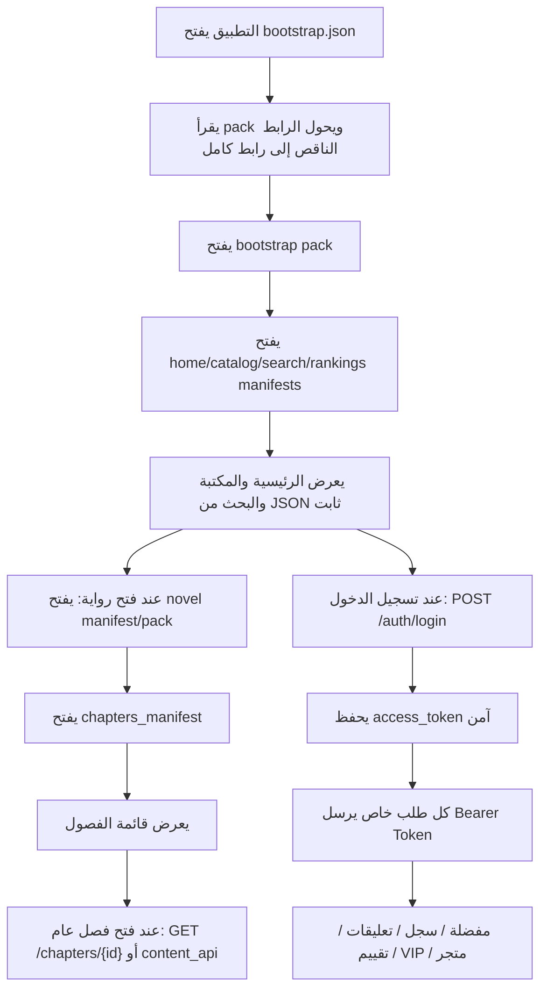

# جرد القالب المحدث: ما يصلح للتطبيق والـ API

تاريخ الفحص: 2026-06-27  
القالب المفحوص: `wor-reader-v2491-app-bearer-auth.zip`  
مسار الملف الأصلي: `C:\Users\Dell\Downloads\wor-reader-v2491-app-bearer-auth.zip`  
الموقع المستهدف: `https://galaxynovels.com`  
مساحة API الأساسية للتطبيق: `/wp-json/wor-reader-app/v1`

> ملاحظة: مراجع الملفات في هذا المستند تشير إلى ملفات القالب بعد فك الضغط، خصوصا `inc/app-api.php` و `inc/app-cache.php` وباقي ملفات `inc`.

## مقياس التقييم

| التقييم | المعنى |
|---|---|
| 5/5 | أساسي جدا للتطبيق ويجب دعمه أو الحفاظ عليه |
| 4/5 | مهم ويعطي قيمة واضحة للتطبيق |
| 3/5 | مفيد لكن يمكن تأجيله |
| 2/5 | اختياري أو مشروط بمرحلة مستقبلية |
| 1/5 | لا أنصح بإدخاله في التطبيق حاليا |

## الخلاصة التنفيذية

القالب المحدث أصبح مناسبا جدا لتطبيق native لأن عنده مسارين واضحين:

1. بيانات عامة قابلة للكاش عبر ملفات JSON ثابتة داخل `/wp-content/uploads/wor-reader-cache/...`.
2. بيانات خاصة بالمستخدم عبر REST API مع `Bearer Token` داخل namespace التطبيق `/wp-json/wor-reader-app/v1`.

أهم نقطة: التطبيق لا يجب أن يعتمد على `WordPress cookies` أو `X-WP-Nonce` في المسارات الخاصة. الطريقة الصحيحة الآن:

```http
Authorization: Bearer ACCESS_TOKEN
User-Agent: WorReaderApp/1.0 Android
```

ولو الاستضافة لا تمرر `Authorization` جيدا:

```http
X-Wor-App-Token: ACCESS_TOKEN
User-Agent: WorReaderApp/1.0 Android
```

تم سد أكبر نقص سابق للتطبيق بعد تعديل القالب: قراءة فصول VIP أصبحت لها endpoint native آمن يرجع JSON و `content_html` عبر `GET /wp-json/wor-reader-app/v1/vip/chapters/{chapter_id}` مع Bearer token. لذلك يجب أن يفتح التطبيق فصول VIP من `content_api` القادم في القائمة أو من هذا المسار، وليس من endpoint الفصول العامة.

## workflow الحالي المقترح للتطبيق



## قواعد عامة يجب تثبيتها في التطبيق

- كل طلب من التطبيق يجب أن يرسل `User-Agent` واضح:
  - `WorReaderApp/1.0 Android`
  - مستقبلا: `WorReaderApp/1.0 iOS`
- المسارات العامة تستخدم ملفات cache قدر الإمكان لتخفيف الضغط على السيرفر.
- المسارات الخاصة تستخدم `Bearer Token`.
- لا نضيف `X-WP-Nonce` في التطبيق native.
- لا نعتمد على namespace القديم `/wp-json/wor-reader/v1` مباشرة إلا لو أضفنا له توافق Bearer أو عملنا alias داخل `/wor-reader-app/v1`.
- أي API خاص بالمستخدم يجب أن يكون `no-store`.
- أي JSON عام مثل catalog/home/search/rankings يمكن كاشه بقوة من Cloudflare/CDN.

## APIs جاهزة ومناسبة للتطبيق الآن

| المجال | API | ماذا يفعل | أهميته للتطبيق | التقييم | الحالة والمصدر |
|---|---|---|---|---|---|
| تسجيل الدخول | `POST /wp-json/wor-reader-app/v1/auth/login` | يسجل دخول المستخدم ويرجع `access_token` وبيانات المستخدم | أساس حسابي، المفضلة، السجل، VIP، التعليقات | 5/5 | جاهز. `inc/app-api.php:22`, `inc/app-api.php:962` |
| تسجيل الخروج | `POST /wp-json/wor-reader-app/v1/auth/logout` | يلغي التوكن الحالي من السيرفر | مهم للأمان وخروج الحساب | 5/5 | جاهز. `inc/app-api.php:33`, `inc/app-api.php:1004` |
| الجلسة | `GET /wp-json/wor-reader-app/v1/session` | يتحقق هل التوكن صالح ويرجع حالة الدخول | مهم لاستمرار تسجيل الدخول بعد إغلاق التطبيق | 5/5 | جاهز. `inc/app-api.php:39`, `inc/app-api.php:1012` |
| bootstrap عام | `GET /wp-json/wor-reader-app/v1/bootstrap` | يرجع bootstrap عام أو يبنيه لو غير موجود | مدخل احتياطي لو لم نقرأ manifest مباشرة | 4/5 | جاهز. `inc/app-api.php:46`, `inc/app-api.php:434` |
| manifest عام | `GET /wp-json/wor-reader-app/v1/public/manifest/{slug}` | يقرأ manifest عام من cache | مفيد كبديل منظم لملفات manifest | 4/5 | جاهز. `inc/app-api.php:73`, `inc/app-api.php:400` |
| pack عام | `GET /wp-json/wor-reader-app/v1/public/pack/{file}.json` | يقرأ pack عام من cache | مفيد لو أردنا المرور عبر REST بدل رابط الملف المباشر | 4/5 | جاهز. `inc/app-api.php:80`, `inc/app-api.php:417` |
| تفاصيل رواية عامة | `GET /wp-json/wor-reader-app/v1/novels/{novel_id}` | يرجع بيانات رواية من cache/pack | أساسي لشاشة تفاصيل الرواية | 5/5 | جاهز. `inc/app-api.php:52`, `inc/app-api.php:442` |
| فصول رواية عامة | `GET /wp-json/wor-reader-app/v1/novels/{novel_id}/chapters` | يرجع قائمة فصول الرواية من manifest/pack | أساسي للتفاصيل والقارئ | 5/5 | جاهز. `inc/app-api.php:59`, `inc/app-api.php:455` |
| محتوى فصل عام | `GET /wp-json/wor-reader-app/v1/chapters/{chapter_id}` | يرجع محتوى الفصل بصيغة JSON مع `content_html` والتنقل | أساس القارئ native | 5/5 | جاهز. `inc/app-api.php:66`, `inc/app-api.php:491`, `inc/app-cache.php:761` |
| بيانات المستخدم | `GET /wp-json/wor-reader-app/v1/me` | يرجع الاسم، الصورة، VIP، XP مختصر | أساس صفحة حسابي | 5/5 | جاهز. `inc/app-api.php:87`, `inc/app-api.php:1040` |
| حالة المستخدم داخل رواية | `GET /wp-json/wor-reader-app/v1/me/novels/{novel_id}` | يرجع حالة الرواية للمستخدم مثل المفضلة/السجل حسب المتاح | مهم لتفاصيل الرواية | 4/5 | جاهز. `inc/app-api.php:93` |
| المفضلة | `GET /wp-json/wor-reader-app/v1/me/favorites` | يجلب روايات المستخدم المفضلة | أساسي للمكتبة الشخصية | 5/5 | جاهز. `inc/app-api.php:100`, `inc/favorites.php:103` |
| مزامنة المفضلة | `POST /wp-json/wor-reader-app/v1/me/favorites/sync` | يضيف/يحذف المفضلة بدفعات | مهم للأوفلاين والمزامنة | 5/5 | جاهز. `inc/app-api.php:106`, `inc/favorites.php:129` |
| السجل | `GET /wp-json/wor-reader-app/v1/me/history` | يجلب سجل القراءة | أساسي لشاشة السجل وأكمل القراءة | 5/5 | جاهز. `inc/app-api.php:112` |
| سجل رواية واحدة | `GET /wp-json/wor-reader-app/v1/me/history/novel/{novel_id}` | يجلب آخر تقدم داخل رواية | مهم لزر متابعة القراءة | 5/5 | جاهز. `inc/app-api.php:118` |
| مزامنة القراءة | `POST /wp-json/wor-reader-app/v1/reading/sync` | يرسل تقدم القراءة والفصول المقروءة | أساسي للسجل والمتابعة | 5/5 | جاهز. `inc/app-api.php:125`, `inc/activity.php:674` |
| تقييم رواية | `GET /wp-json/wor-reader-app/v1/ratings/novel/{novel_id}` | يجلب تقييم المستخدم/الرواية | مفيد في التفاصيل | 4/5 | جاهز. `inc/app-api.php:131`, `inc/novel-ratings.php:208` |
| إرسال تقييم | `POST /wp-json/wor-reader-app/v1/ratings/novel/{novel_id}` | يرسل تقييم 1-5 | يزيد تفاعل المستخدم | 4/5 | جاهز. `inc/app-api.php:137`, `inc/novel-ratings.php:238` |
| تعليقات رواية/فصل | `GET /wp-json/wor-reader-app/v1/comments/{novel|chapter}/{id}` | يجلب التعليقات | مهم للمجتمع لكن يمكن تأجيل تحسينه | 4/5 | جاهز بشرط تفعيل comments. `inc/app-api.php:165`, `inc/comments.php:1626` |
| إضافة تعليق | `POST /wp-json/wor-reader-app/v1/comments/{novel|chapter}/{id}` | يضيف تعليق | مفيد للتفاعل | 4/5 | جاهز بشرط تفعيل comments. `inc/app-api.php:173`, `inc/comments.php:1650` |
| تصويت تعليق | `POST /wp-json/wor-reader-app/v1/comments/{comment_id}/vote` | إعجاب/عدم إعجاب على تعليق | تحسين مجتمعي | 3/5 | جاهز بشرط تفعيل comments. `inc/app-api.php:183`, `inc/comments.php:1682` |
| تفاعل تعليقات | `POST /wp-json/wor-reader-app/v1/comments/{novel|chapter}/{id}/reaction` | يرسل reaction على صفحة تعليقات | لطيف لكن ليس أساسيا | 3/5 | جاهز بشرط تفعيل comments. `inc/app-api.php:191`, `inc/comments.php:1689` |
| قائمة فصول VIP | `GET /wp-json/wor-reader-app/v1/vip/chapters` | يجلب الفصول المتاحة لمشتركي VIP | مهم جدا لو سنضيف VIP | 4/5 | جاهز بشرط تفعيل VIP. `inc/app-api.php:203`, `inc/vip-subscriptions.php:1440` |
| محتوى فصل VIP | `GET /wp-json/wor-reader-app/v1/vip/chapters/{chapter_id}` | يرجع محتوى فصل VIP كـ JSON داخل `data.content_html` مع navigation خاص | أساسي لقارئ VIP native بدون WebView | 5/5 | جاهز بعد تعديل القالب. يجب إرساله مع Bearer token. |
| VIP continuous next | `GET /wp-json/wor-reader-app/v1/vip/continuous-next` | يرجع HTML للفصل التالي في قراءة VIP المتصلة | مفيد للويب أكثر من التطبيق native | 2/5 | جاهز لكن غير مثالي للتطبيق. `inc/app-api.php:218`, `inc/vip-subscriptions.php:1461` |
| عدادات مكتبة VIP | `POST /wp-json/wor-reader-app/v1/vip/library-counts` | يرجع عدادات/حالات مرتبطة بفصول VIP | مفيد لشاشة VIP أو التفاصيل | 3/5 | جاهز بشرط تفعيل VIP. `inc/app-api.php:225` |
| إنشاء طلب متجر | `POST /wp-json/wor-reader-app/v1/store/create-order` | يبدأ طلب PayPal للدفع مرة واحدة | مهم مستقبلا، مؤجل حاليا | 2/5 | جاهز بشرط تفعيل store. `inc/app-api.php:233`, `inc/store-paypal.php:488` |
| تأكيد طلب متجر | `POST /wp-json/wor-reader-app/v1/store/capture-order` | يؤكد الدفع بعد PayPal | مؤجل مع الدفع | 2/5 | جاهز بشرط تفعيل store. `inc/app-api.php:242`, `inc/store-paypal.php:543` |
| إنشاء اشتراك | `POST /wp-json/wor-reader-app/v1/store/create-subscription` | يبدأ اشتراك PayPal | مؤجل مع الدفع | 2/5 | جاهز. `inc/app-api.php:251`, `inc/store-paypal.php:299` |
| تفعيل اشتراك | `POST /wp-json/wor-reader-app/v1/store/activate-subscription` | يربط اشتراك PayPal بحساب المستخدم | مؤجل مع الدفع | 2/5 | جاهز. `inc/app-api.php:260`, `inc/store-paypal.php:360` |
| إلغاء اشتراك | `POST /wp-json/wor-reader-app/v1/store/cancel-subscription` | يلغي اشتراك المستخدم | مؤجل مع الدفع | 2/5 | جاهز. `inc/app-api.php:269`, `inc/store-paypal.php:441` |
| تصويت جوائز المترجمين | `POST /wp-json/wor-reader-app/v1/translator-awards/vote` | يصوت المستخدم لرواية/مترجم في الجوائز | ميزة مجتمع مستقبلية | 2/5 | جاهز بشرط تفعيلها. `inc/app-api.php:156`, `inc/translator-awards.php:946` |

## ملفات JSON العامة التي يجب أن يعتمد عليها التطبيق لتخفيف الضغط

| الملف/المسار | ماذا يحتوي | أين يستخدم في التطبيق | التقييم | المصدر |
|---|---|---|---|---|
| `/wp-content/uploads/wor-reader-cache/app/manifest/bootstrap.json` | مدخل manifest الرئيسي وفيه رابط `pack` | أول تشغيل وتحديث بيانات التطبيق | 5/5 | `inc/app-cache.php:399` |
| `bootstrap pack` | معلومات الموقع، روابط manifests، features، limits | تحديد ما يظهر في التطبيق وتفعيل/تعطيل الميزات | 5/5 | `inc/app-cache.php:399` |
| `home_manifest` و `home pack` | آخر الفصول، روايات محدثة، اختيارات يومية | الصفحة الرئيسية | 5/5 | `inc/app-cache.php:439` |
| `catalog_manifest` و packs | كل الروايات مقسمة chunks بحجم 500 | المكتبة والفلترة المحلية | 5/5 | `inc/app-cache.php:475` |
| `search_manifest` | index بحث خفيف يحتوي title/original/genres/status/rank | البحث السريع بدون ضغط REST | 5/5 | `inc/novel-search-index.php:114`, `inc/novel-search-index.php:285` |
| `rankings_manifest` | روايات شائعة شهريا | صفحة الترتيب | 4/5 | `inc/app-cache.php:529` |
| `store_manifest` | إعدادات المتجر والخطط العامة | شاشة VIP/المتجر مستقبلا | 4/5 | `inc/app-cache.php:549`, `inc/store.php:460` |
| `novel manifest/pack` | تفاصيل رواية كاملة وروابط فصولها | صفحة تفاصيل الرواية | 5/5 | `inc/app-cache.php:558`, `inc/app-cache.php:333` |
| `chapters_manifest` و chapter pack | قائمة فصول الرواية وروابطها | تفاصيل الرواية والقارئ | 5/5 | `functions.php:2198`, `inc/app-api.php:455` |
| `chapter content pack` | محتوى فصل عام بصيغة JSON | القارئ native | 5/5 | `inc/app-cache.php:761`, `inc/app-cache.php:846` |
| `vip_schedule_manifest` | جدول إتاحة فصول VIP للعامة بدون محتوى | إظهار أن الرواية لها فصول مبكرة/قادمة | 4/5 | `inc/vip-release-schedule.php:90`, `inc/app-cache.php:392` |

## ميزات موجودة في القالب لكنها تحتاج API أو alias أفضل للتطبيق

| الميزة | المقترح للتطبيق | ماذا تفعل | لماذا مهمة | التقييم | الموجود حاليا/المصدر |
|---|---|---|---|---|---|
| آخر فصول VIP للواجهة | `GET /wp-json/wor-reader-app/v1/vip/home-latest` | يجلب أحدث فصول VIP للصفحة الرئيسية أو قسم VIP | مفيد لو سنعمل شاشة VIP جذابة | 4/5 | موجود في legacy namespace فقط. `inc/vip-subscriptions.php:1389` |
| مجلدات المستخدم | `GET /wp-json/wor-reader-app/v1/me/folders` | يجلب مجلدات المستخدم وحدوده | مهم لتنظيم المكتبة والمفضلة | 4/5 | موجود legacy فقط ويتطلب nonce. `inc/folders.php:437`, `inc/folders.php:498` |
| إنشاء مجلد | `POST /wp-json/wor-reader-app/v1/folders` | ينشئ مجلد عام/خاص | يعطي التطبيق ميزة مكتبة قوية | 4/5 | موجود legacy فقط. `inc/folders.php:444`, `inc/folders.php:524` |
| قائمة المجلدات العامة | `GET /wp-json/wor-reader-app/v1/folders` | يعرض مجلدات عامة يتابعها الناس | ميزة اكتشاف اجتماعية جيدة | 3/5 | موجود legacy فقط. `inc/folders.php:444`, `inc/folders.php:761` |
| تفاصيل مجلد | `GET /wp-json/wor-reader-app/v1/folders/{folder_id}` | يعرض الروايات داخل مجلد مع sort/status grouping | مفيد للمكتبة ومشاركة القوائم | 4/5 | موجود legacy فقط. `inc/folders.php:452`, `inc/folders.php:807` |
| تعديل/حذف مجلد | `PATCH/DELETE /wp-json/wor-reader-app/v1/folders/{folder_id}` | يدير مجلدات المستخدم | مطلوب لو أضفنا المجلدات | 3/5 | موجود legacy فقط. `inc/folders.php:452` |
| إضافة/حذف رواية من مجلد | `POST /wp-json/wor-reader-app/v1/folders/{folder_id}/novels` | يربط الروايات بالمجلدات | مهم لو اعتمدنا المجلدات | 4/5 | موجود legacy فقط. `inc/folders.php:467` |
| متابعة مجلد | `POST /wp-json/wor-reader-app/v1/folders/{folder_id}/follow` | متابعة/إلغاء متابعة مجلد عام | اجتماعي، ليس ضروريا للنسخة الأولى | 3/5 | موجود legacy فقط. `inc/folders.php:477` |
| إحصائيات حساب موسعة | `GET /wp-json/wor-reader-app/v1/me/stats` | يرجع الرتبة، الساعات، الفصول، XP، التقدم للمستوى | يجعل صفحة حسابي أغنى | 4/5 | الإحصائيات موجودة داخليا. `inc/account.php:317` |
| ترتيب المستخدم الحالي | `GET /wp-json/wor-reader-app/v1/rankings/me` | يرجع ترتيب المستخدم ومعلومات XP | مناسب للحساب والإنجازات | 4/5 | موجود legacy فقط. `inc/rankings.php:835` |
| تعديل الاسم | `PATCH /wp-json/wor-reader-app/v1/me/profile` | يغير اسم العرض | مهم لحسابي | 4/5 | موجود legacy/account فقط. `inc/account.php:572`, `inc/account.php:603` |
| تغيير الصورة | `POST /wp-json/wor-reader-app/v1/me/avatar` | يرفع avatar من التطبيق | جيد للحساب لكنه ليس أساسيا | 3/5 | موجود legacy/account فقط. `inc/account.php:580`, `inc/account.php:631` |
| تسجيل حساب جديد | `POST /wp-json/wor-reader-app/v1/auth/register` | إنشاء حساب من التطبيق | مهم للنمو، لكنه يحتاج anti-abuse مناسب native | 4/5 | الموجود AJAX للويب فقط. `inc/auth-ui.php:513` |
| طلب استعادة كلمة مرور | `POST /wp-json/wor-reader-app/v1/auth/password/request` | يرسل بريد استعادة كلمة المرور | مهم جدا لتجربة الدخول | 4/5 | الموجود AJAX/صفحة ويب فقط. `inc/auth-ui.php:572`, `inc/password-reset.php:13` |
| إعادة تعيين كلمة المرور | `POST /wp-json/wor-reader-app/v1/auth/password/reset` | يغير كلمة المرور باستخدام key من البريد | جيد لكن يمكن فتح صفحة الويب مؤقتا | 2/5 | الموجود صفحة ويب. `inc/password-reset.php:114` |
| تسجيل مشاهدة عامة | `POST /wp-json/wor-reader-app/v1/public-view` | يرسل مشاهدات رواية/فصل حتى للزوار | مفيد للإحصائيات والترتيب | 3/5 | موجود legacy فقط. `inc/activity.php:506`, `inc/activity.php:564` |
| عدادات الفصول | `GET /wp-json/wor-reader-app/v1/chapter-counters?novel_id=ID` | يرجع عدادات cached للفصول | مفيد لتحديث التعليقات/المشاهدات بدون تحميل ثقيل | 3/5 | موجود legacy فقط. `inc/chapter-counters-cache.php:394` |
| تعديل تعليق | `PATCH /wp-json/wor-reader-app/v1/comments/{comment_id}` | تعديل تعليق المستخدم | جيد لو فعلنا التعليقات بجدية | 3/5 | موجود legacy فقط. `inc/comments.php:1570` |
| حذف تعليق | `DELETE /wp-json/wor-reader-app/v1/comments/{comment_id}` | حذف تعليق المستخدم | مهم لإدارة تعليقات المستخدم | 4/5 | موجود legacy فقط. `inc/comments.php:1579` |
| تثبيت/حظر من التعليقات | `PATCH /comments/{id}/pin`, `POST /comments/{id}/ban` | أدوات إشراف | ليست مهمة للتطبيق العام إلا لو هناك دور مشرف | 1/5 | موجود legacy فقط. `inc/comments.php:1588`, `inc/comments.php:1598` |
| جلسة متجر مختصرة | `GET /wp-json/wor-reader-app/v1/store/session` | يرجع حالة المتجر للمستخدم، subscription، هل PayPal جاهز | مفيد عند فتح شاشة VIP/المتجر | 3/5 | الموجود AJAX bootstrap للويب. `inc/store.php:534` |
| جوائز المترجمين الحالية | `GET /wp-json/wor-reader-app/v1/translator-awards/current` | يعرض الترتيب/الحملة الحالية للتصويت | ميزة مجتمع مستقبلية | 2/5 | الموجود التصويت فقط كـ app alias. `inc/translator-awards.php:946` |
| بحث/مكتبة من السيرفر | `GET /wp-json/wor-reader-app/v1/library?...` | فلترة وسورت من السيرفر بدل catalog local | غير ضروري الآن لأن catalog/search manifest كافيان | 2/5 | منطق الفلترة موجود للويب. `functions.php:2762`, `functions.php:2891` |

## ملاحظات مهمة على namespaces القديمة

القالب يحتوي ميزات كثيرة داخل namespace قديم:

```text
/wp-json/wor-reader/v1
```

لكن التطبيق يجب أن يفضل:

```text
/wp-json/wor-reader-app/v1
```

السبب: نظام Bearer الجديد مربوط بشكل واضح بمسارات التطبيق. بعض ملفات القالب القديمة تسمح بتجاوز nonce لو الطلب من app namespace، مثل favorites/comments/ratings. لكن بعض الميزات مثل folders/account ما زالت مرتبطة بالويب أو nonce/جلسة WordPress، لذلك لا تكفي للتطبيق إلا بعد عمل alias داخل app namespace أو تعديل permission callback لقبول Bearer.

## ترتيب التنفيذ المقترح

| الأولوية | المهمة | السبب | التقييم |
|---|---|---|---|
| 1 | إضافة aliases للمجلدات مع Bearer auth | تقوي المكتبة وتفتح ميزات تنظيم الروايات | 4/5 |
| 2 | إضافة APIs للحساب: stats/profile/avatar | تجعل صفحة حسابي حقيقية وليست بسيطة | 4/5 |
| 3 | إضافة register/password APIs أو حل native مناسب | يحل دورة الحساب كاملة داخل التطبيق | 4/5 |
| 4 | إضافة store/session فقط، وتأجيل الدفع | مفيد لعرض VIP بدون الدخول في شراء الآن | 3/5 |
| 5 | إضافة public-view/chapter-counters aliases | تحسين الإحصائيات بدون ضغط كبير | 3/5 |
| 6 | إضافة edit/delete comments aliases | مفيد عندما ننضج نظام التعليقات | 3/5 |
| 7 | جوائز المترجمين وranking متقدم | ميزة لاحقة وليست أساسية | 2/5 |

## أشياء لا أنصح بإدخالها في التطبيق الآن

| العنصر | السبب | التقييم |
|---|---|---|
| `POST /store/paypal-webhook` | هذا endpoint للسيرفر وPayPal فقط، لا يجب أن يستدعيه التطبيق | 1/5 |
| أدوات الإدارة والاستيراد | تخص لوحة التحكم ولا تناسب تطبيق المستخدم النهائي | 1/5 |
| صفحات الويب الداخلية مثل `account/reset-password` داخل WebView دائم | يمكن استخدامها مؤقتا، لكن الأفضل API native لاحقا | 2/5 |
| `vip/continuous-next` كحل قارئ أساسي | يرجع HTML fragment ومناسب للويب أكثر من native | 2/5 |
| استخدام `/wp-json/wor-reader/v1` مباشرة في التطبيق للميزات الخاصة | غالبا يحتاج nonce/cookies أو لا يضمن Bearer | 1/5 |

## توصية نهائية

القالب المحدث فيه أساس ممتاز للتطبيق: login Bearer، session، me، favorites، history، reading sync، ratings، comments، public packs، native public chapter content، وقائمة VIP ومحتوى فصول VIP native.

لكن لو سنبني نسخة تطبيق قوية فعلا، أهم APIs ناقصة أو تحتاج تعديل هي:

1. `Folders` داخل app namespace مع Bearer.
2. `Account stats/profile/avatar` داخل app namespace.
3. `Register/password` بطريقة native.
4. `Store/session` بدون الدخول في الدفع الآن.

أي شيء آخر يمكن تأجيله حتى لا نكبر التطبيق قبل أن تكتمل تجربة القراءة والحساب والمكتبة.
